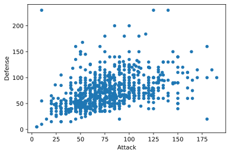

이 글은 아래  'Data ScienceTutorial for Beginners'를 번역한 글 입니다.
최대한 부드럽게 번역하려 노력했으며, 원글의 표현에서 벗어나지 않는 선에서 초월번역(?)을 했습니다.
원글은 아래 링크를 통해 확인하실 수 있습니다.
영어가 필요하다 싶은 부분들은 원문 그대로 썼으며, 많이 부족하다보니 언제든지 피드백 환영합니다.

함수 파라미터 관련은 번역이 필요하면 번역합니다.
'''
https://www.kaggle.com/kanncaa1/data-sciencetutorial-for-beginners/

원제 : Data ScienceTutorial for Beginners


# DATA SCIENTIST

**이 튜토리얼은 Data Scientist가 되기 위해 필요한 것을 설명하기 위해 작성되었다.**

Data Scientist는 아래의 기술들이 필요하다.

1. Basic Tools(기본 툴) : Python, R or SQL. 물론 모든것을 알 필요는 없다. 파이썬만 사용할 줄 알아도 충분하다.
2. Basic Statistics(기본 통계): 평균, 표준편차, 중간값. 기본 통계들을 알고 있다면 파이썬을 쉽게 사용할 수 있다.
3. Data Munging(데이터 정제) : 정리가 되지 않은 데이터. 예를 들어 일치하지 않는 날짜, 문자열 형식 ex) 2020-01-01 , 01-02 Python은 당신의 생각대로 정리가 되도록 도와준다.
4. Data Visualization(데이터 시각화) : Data Visualization은 설명과 같다. matplot, seaborn 같은 라이브러리를 이용하여 파이썬으로 데이터를 시각화한다.
5. Machine Learning(기계 학습) : Machine Learning 기술에 있는 수학을 이해할 필요는 없다. 기계학습의 기본을 이해하고 파이썬을 사용하여 구현하는 방법을 배우면 된다.

###요약을 하자면 Data Scientist가 되는 파이썬을 배울 것이다. !!!

    
**목차**

1. [Introduction to Python:](#1)
    1. [Matplotlib](#2)
    1. [Dictionaries ](#3)
    1. [Pandas](#4)
    1. [Logic, control flow and filtering](#5)
    1. [Loop data structures](#6)
1. [Python Data Science Toolbox:](#7)
    1. [User defined function](#8)
    1. [Scope](#9)
    1. [Nested function](#10)
    1. [Default and flexible arguments](#11)
    1. [Lambda function](#12)
    1. [Anonymous function](#13)
    1. [Iterators](#14)
    1. [List comprehension](#15)
1. [Cleaning Data](#16)
    1. [Diagnose data for cleaning](#17)
    1. [Exploratory data analysis](#18)
    1. [Visual exploratory data analysis](#19)
    1. [Tidy data](#20)
    1. [Pivoting data](#21)
    1. [Concatenating data](#22)
    1. [Data types](#23)
    1. [Missing data and testing with assert](#24)
1. [Pandas Foundation](#25)
    1. [Review of pandas](#26)
    1. [Building data frames from scratch](#27)
    1. [Visual exploratory data analysis](#28)
    1. [Statistical explatory data analysis](#29)
    1. [Indexing pandas time series](#30)
    1. [Resampling pandas time series](#31)
1. [Manipulating Data Frames with Pandas](#32)
    1. [Indexing data frames](#33)
    1. [Slicing data frames](#34)
    1. [Filtering data frames](#35)
    1. [Transforming data frames](#36)
    1. [Index objects and labeled data](#37)
    1. [Hierarchical indexing](#38)
    1. [Pivoting data frames](#39)
    1. [Stacking and unstacking data frames](#40)
    1. [Melting data frames](#41)
    1. [Categoricals and groupby](#42)
1. Data Visualization
    1. Seaborn: https://www.kaggle.com/kanncaa1/seaborn-for-beginners
    1. Bokeh 1: https://www.kaggle.com/kanncaa1/interactive-bokeh-tutorial-part-1
    1. Rare Visualization: https://www.kaggle.com/kanncaa1/rare-visualization-tools
    1. Plotly: https://www.kaggle.com/kanncaa1/plotly-tutorial-for-beginners
1. Machine Learning
    1. https://www.kaggle.com/kanncaa1/machine-learning-tutorial-for-beginners/
1. Deep Learning
    1. https://www.kaggle.com/kanncaa1/deep-learning-tutorial-for-beginners
1. Time Series Prediction
    1. https://www.kaggle.com/kanncaa1/time-series-prediction-tutorial-with-eda
1. Statistic
    1. https://www.kaggle.com/kanncaa1/basic-statistic-tutorial-for-beginners
1. Deep Learning with Pytorch
    1. Artificial Neural Network: https://www.kaggle.com/kanncaa1/pytorch-tutorial-for-deep-learning-lovers
    1. Convolutional Neural Network: https://www.kaggle.com/kanncaa1/pytorch-tutorial-for-deep-learning-lovers
    1. Recurrent Neural Network: https://www.kaggle.com/kanncaa1/recurrent-neural-network-with-pytorch


```
# 이 Python3 환경에는 유용한 분석 라이브러리들이 많이 설치 되어있습니다.
# kaggle/python docker 이미지는 https://github.com/kaggle/docker-python 에서 받아보실수 있습니다. 
# 예를 들어 불러올 때 유용한 패키지들이 몇개 있습니다.

import numpy as np # Linear Algebra (선형대수)
import pandas as pd # Data Processing CSV file I/O (e.g. pd.read_csv)
import matplotlib.pyplot as plt
import seaborn as sns  # visualization tool

# 입력 데이터는 "../input/" 폴더 안에 있습니다. 
# 예를 들어,  실행하면(실행을 클릭하거나 Shift+Enter를 눌러) 입력 폴더에 파일이 나열됩니다.from subprocess import check_output

# *역자 : 데이터의 위치가 예전과 현재 바뀐 상태이다. 우리는 위의 코드를 통해 정확한 경로를 알 수 있다.
# *역자 : 데이터의 위치가 다르므로 역자는 file_path를 변수로 지정하여 경로를 고정해서 가져가려 한다.
# *역자 : 파일 경로는 file_path를 각자의 환경 상황에 맞춰 바꿔주면 된다.
file_path = '../../DataSet/2619_4359_bundle_archive'

from subprocess import check_output

# print(check_output(["ls", file_path]).decode("utf8"))
# print(check_output(["ls", "../input"]).decode("utf8"))

import os
#for dirname, _, filenames in os.walk("/kaggle/input"):
# for dirname, _, filenames in os.walk(file_path):
#     for filename in filenames:
#         print(os.path.join(dirname, filename))
# 현재 디렉토리에 쓰는 모든 결과는 출력으로 저장됩니다.
```

위의 코드를 실행할 때에 그림과 같이 경고 메세지가 뜬다면 pd.read_csv()에 그림과 같이 ".csv" 경로를 넣어주어야 한다.

<a href="https://ibb.co/Hg0QX2h"></a>


```
#data = pd.read_csv('/kaggle/input/pokemon.csv')
#data.head()


file_path = '../../DataSet/2619_4359_bundle_archive/'

#data = pd.read_csv('../input/pokemon.csv') 
data = pd.read_csv(file_path+'pokemon.csv')


data.head()

```


<div>
<style scoped>
    .dataframe tbody tr th:only-of-type {
        vertical-align: middle;
    }

    .dataframe tbody tr th {
        vertical-align: top;
    }

    .dataframe thead th {
        text-align: right;
    }
</style>
<table border="1" class="dataframe">
  <thead>
    <tr style="text-align: right;">
      <th></th>
      <th>#</th>
      <th>Name</th>
      <th>Type 1</th>
      <th>Type 2</th>
      <th>HP</th>
      <th>Attack</th>
      <th>Defense</th>
      <th>Sp. Atk</th>
      <th>Sp. Def</th>
      <th>Speed</th>
      <th>Generation</th>
      <th>Legendary</th>
    </tr>
  </thead>
  <tbody>
    <tr>
      <th>0</th>
      <td>1</td>
      <td>Bulbasaur</td>
      <td>Grass</td>
      <td>Poison</td>
      <td>45</td>
      <td>49</td>
      <td>49</td>
      <td>65</td>
      <td>65</td>
      <td>45</td>
      <td>1</td>
      <td>False</td>
    </tr>
    <tr>
      <th>1</th>
      <td>2</td>
      <td>Ivysaur</td>
      <td>Grass</td>
      <td>Poison</td>
      <td>60</td>
      <td>62</td>
      <td>63</td>
      <td>80</td>
      <td>80</td>
      <td>60</td>
      <td>1</td>
      <td>False</td>
    </tr>
    <tr>
      <th>2</th>
      <td>3</td>
      <td>Venusaur</td>
      <td>Grass</td>
      <td>Poison</td>
      <td>80</td>
      <td>82</td>
      <td>83</td>
      <td>100</td>
      <td>100</td>
      <td>80</td>
      <td>1</td>
      <td>False</td>
    </tr>
    <tr>
      <th>3</th>
      <td>4</td>
      <td>Mega Venusaur</td>
      <td>Grass</td>
      <td>Poison</td>
      <td>80</td>
      <td>100</td>
      <td>123</td>
      <td>122</td>
      <td>120</td>
      <td>80</td>
      <td>1</td>
      <td>False</td>
    </tr>
    <tr>
      <th>4</th>
      <td>5</td>
      <td>Charmander</td>
      <td>Fire</td>
      <td>NaN</td>
      <td>39</td>
      <td>52</td>
      <td>43</td>
      <td>60</td>
      <td>50</td>
      <td>65</td>
      <td>1</td>
      <td>False</td>
    </tr>
  </tbody>
</table>
</div>


```
data.info()
```

    <class 'pandas.core.frame.DataFrame'>
    RangeIndex: 800 entries, 0 to 799
    Data columns (total 12 columns):
     #   Column      Non-Null Count  Dtype 
    ---  ------      --------------  ----- 
     0   #           800 non-null    int64 
     1   Name        799 non-null    object
     2   Type 1      800 non-null    object
     3   Type 2      414 non-null    object
     4   HP          800 non-null    int64 
     5   Attack      800 non-null    int64 
     6   Defense     800 non-null    int64 
     7   Sp. Atk     800 non-null    int64 
     8   Sp. Def     800 non-null    int64 
     9   Speed       800 non-null    int64 
     10  Generation  800 non-null    int64 
     11  Legendary   800 non-null    bool  
    dtypes: bool(1), int64(8), object(3)
    memory usage: 69.7+ KB
    


```
data.corr()
```


<div>
<style scoped>
    .dataframe tbody tr th:only-of-type {
        vertical-align: middle;
    }

    .dataframe tbody tr th {
        vertical-align: top;
    }

    .dataframe thead th {
        text-align: right;
    }
</style>
<table border="1" class="dataframe">
  <thead>
    <tr style="text-align: right;">
      <th></th>
      <th>#</th>
      <th>HP</th>
      <th>Attack</th>
      <th>Defense</th>
      <th>Sp. Atk</th>
      <th>Sp. Def</th>
      <th>Speed</th>
      <th>Generation</th>
      <th>Legendary</th>
    </tr>
  </thead>
  <tbody>
    <tr>
      <th>#</th>
      <td>1.000000</td>
      <td>0.097712</td>
      <td>0.102664</td>
      <td>0.094691</td>
      <td>0.089199</td>
      <td>0.085596</td>
      <td>0.012181</td>
      <td>0.983428</td>
      <td>0.154336</td>
    </tr>
    <tr>
      <th>HP</th>
      <td>0.097712</td>
      <td>1.000000</td>
      <td>0.422386</td>
      <td>0.239622</td>
      <td>0.362380</td>
      <td>0.378718</td>
      <td>0.175952</td>
      <td>0.058683</td>
      <td>0.273620</td>
    </tr>
    <tr>
      <th>Attack</th>
      <td>0.102664</td>
      <td>0.422386</td>
      <td>1.000000</td>
      <td>0.438687</td>
      <td>0.396362</td>
      <td>0.263990</td>
      <td>0.381240</td>
      <td>0.051451</td>
      <td>0.345408</td>
    </tr>
    <tr>
      <th>Defense</th>
      <td>0.094691</td>
      <td>0.239622</td>
      <td>0.438687</td>
      <td>1.000000</td>
      <td>0.223549</td>
      <td>0.510747</td>
      <td>0.015227</td>
      <td>0.042419</td>
      <td>0.246377</td>
    </tr>
    <tr>
      <th>Sp. Atk</th>
      <td>0.089199</td>
      <td>0.362380</td>
      <td>0.396362</td>
      <td>0.223549</td>
      <td>1.000000</td>
      <td>0.506121</td>
      <td>0.473018</td>
      <td>0.036437</td>
      <td>0.448907</td>
    </tr>
    <tr>
      <th>Sp. Def</th>
      <td>0.085596</td>
      <td>0.378718</td>
      <td>0.263990</td>
      <td>0.510747</td>
      <td>0.506121</td>
      <td>1.000000</td>
      <td>0.259133</td>
      <td>0.028486</td>
      <td>0.363937</td>
    </tr>
    <tr>
      <th>Speed</th>
      <td>0.012181</td>
      <td>0.175952</td>
      <td>0.381240</td>
      <td>0.015227</td>
      <td>0.473018</td>
      <td>0.259133</td>
      <td>1.000000</td>
      <td>-0.023121</td>
      <td>0.326715</td>
    </tr>
    <tr>
      <th>Generation</th>
      <td>0.983428</td>
      <td>0.058683</td>
      <td>0.051451</td>
      <td>0.042419</td>
      <td>0.036437</td>
      <td>0.028486</td>
      <td>-0.023121</td>
      <td>1.000000</td>
      <td>0.079794</td>
    </tr>
    <tr>
      <th>Legendary</th>
      <td>0.154336</td>
      <td>0.273620</td>
      <td>0.345408</td>
      <td>0.246377</td>
      <td>0.448907</td>
      <td>0.363937</td>
      <td>0.326715</td>
      <td>0.079794</td>
      <td>1.000000</td>
    </tr>
  </tbody>
</table>
</div>


```
# correlation map (상관 관계)
f,ax = plt.subplots(figsize=(18,18))
sns.heatmap(data.corr(), annot=True, linewidths=.5, fmt= '.1f',ax=ax)
plt.show()
```


```
data.head(10)
```


<div>
<style scoped>
    .dataframe tbody tr th:only-of-type {
        vertical-align: middle;
    }

    .dataframe tbody tr th {
        vertical-align: top;
    }

    .dataframe thead th {
        text-align: right;
    }
</style>
<table border="1" class="dataframe">
  <thead>
    <tr style="text-align: right;">
      <th></th>
      <th>#</th>
      <th>Name</th>
      <th>Type 1</th>
      <th>Type 2</th>
      <th>HP</th>
      <th>Attack</th>
      <th>Defense</th>
      <th>Sp. Atk</th>
      <th>Sp. Def</th>
      <th>Speed</th>
      <th>Generation</th>
      <th>Legendary</th>
    </tr>
  </thead>
  <tbody>
    <tr>
      <th>0</th>
      <td>1</td>
      <td>Bulbasaur</td>
      <td>Grass</td>
      <td>Poison</td>
      <td>45</td>
      <td>49</td>
      <td>49</td>
      <td>65</td>
      <td>65</td>
      <td>45</td>
      <td>1</td>
      <td>False</td>
    </tr>
    <tr>
      <th>1</th>
      <td>2</td>
      <td>Ivysaur</td>
      <td>Grass</td>
      <td>Poison</td>
      <td>60</td>
      <td>62</td>
      <td>63</td>
      <td>80</td>
      <td>80</td>
      <td>60</td>
      <td>1</td>
      <td>False</td>
    </tr>
    <tr>
      <th>2</th>
      <td>3</td>
      <td>Venusaur</td>
      <td>Grass</td>
      <td>Poison</td>
      <td>80</td>
      <td>82</td>
      <td>83</td>
      <td>100</td>
      <td>100</td>
      <td>80</td>
      <td>1</td>
      <td>False</td>
    </tr>
    <tr>
      <th>3</th>
      <td>4</td>
      <td>Mega Venusaur</td>
      <td>Grass</td>
      <td>Poison</td>
      <td>80</td>
      <td>100</td>
      <td>123</td>
      <td>122</td>
      <td>120</td>
      <td>80</td>
      <td>1</td>
      <td>False</td>
    </tr>
    <tr>
      <th>4</th>
      <td>5</td>
      <td>Charmander</td>
      <td>Fire</td>
      <td>NaN</td>
      <td>39</td>
      <td>52</td>
      <td>43</td>
      <td>60</td>
      <td>50</td>
      <td>65</td>
      <td>1</td>
      <td>False</td>
    </tr>
    <tr>
      <th>5</th>
      <td>6</td>
      <td>Charmeleon</td>
      <td>Fire</td>
      <td>NaN</td>
      <td>58</td>
      <td>64</td>
      <td>58</td>
      <td>80</td>
      <td>65</td>
      <td>80</td>
      <td>1</td>
      <td>False</td>
    </tr>
    <tr>
      <th>6</th>
      <td>7</td>
      <td>Charizard</td>
      <td>Fire</td>
      <td>Flying</td>
      <td>78</td>
      <td>84</td>
      <td>78</td>
      <td>109</td>
      <td>85</td>
      <td>100</td>
      <td>1</td>
      <td>False</td>
    </tr>
    <tr>
      <th>7</th>
      <td>8</td>
      <td>Mega Charizard X</td>
      <td>Fire</td>
      <td>Dragon</td>
      <td>78</td>
      <td>130</td>
      <td>111</td>
      <td>130</td>
      <td>85</td>
      <td>100</td>
      <td>1</td>
      <td>False</td>
    </tr>
    <tr>
      <th>8</th>
      <td>9</td>
      <td>Mega Charizard Y</td>
      <td>Fire</td>
      <td>Flying</td>
      <td>78</td>
      <td>104</td>
      <td>78</td>
      <td>159</td>
      <td>115</td>
      <td>100</td>
      <td>1</td>
      <td>False</td>
    </tr>
    <tr>
      <th>9</th>
      <td>10</td>
      <td>Squirtle</td>
      <td>Water</td>
      <td>NaN</td>
      <td>44</td>
      <td>48</td>
      <td>65</td>
      <td>50</td>
      <td>64</td>
      <td>43</td>
      <td>1</td>
      <td>False</td>
    </tr>
  </tbody>
</table>
</div>


```
data.columns
```


    Index(['#', 'Name', 'Type 1', 'Type 2', 'HP', 'Attack', 'Defense', 'Sp. Atk',
           'Sp. Def', 'Speed', 'Generation', 'Legendary'],
          dtype='object')


<a id="1"></a> <br>
# 1. INTRODUCTION TO PYTHON


<a id="2"></a> <br>
### MATPLOTLIB
Matplot은 Data를 그리는데에 도움을 주는 python 라이브러리입니다.
쉽고 기본적인 plot은 선(Line), 분산(Scatter), 히스토그램(Histogram) Plot입니다.

* Line plot은 X축이 시간일때 더 좋습니다.
* Scatter는 두 변수 사이에 상관 관계가 있을 때 사용하면 좋습니다.
* Histogram은 수치 데이터의 분포를 볼 때 좋습니다.
* Customization : 색상, 레이블, 선 두께, 불 투명도, 격자, 그림크기, 축 눈금, 선 스타일
* (Customization: Colors,labels,thickness of line, title, opacity, grid, figsize, ticks of axis and linestyle)


```
# Line Plot
# color = color, label = label, linewidth = width of line, alpha = opacity, grid = grid, linestyle = sytle of line

data.Speed.plot(kind = 'line', color = 'g',label = 'Speed',linewidth=1,alpha = 0.5,grid = True,linestyle = ':')
data.Defense.plot(color = 'r',label = 'Defense',linewidth=1, alpha = 0.5,grid = True,linestyle = '-.')
plt.legend(loc='upper right')     # legend = puts label into plot
plt.xlabel('x axis')              # label = name of label
plt.ylabel('y axis')
plt.title('Line Plot')            # title = title of plot
plt.show()
```


```
# Scatter Plot
# x = attack, y = defense

data.plot(kind = 'scatter', x='Attack', y='Defense', alpha = 0.5, color = 'red')
plt.xlabel('Attack')    #label = name of label 
plt.ylabel('Defence')
plt.title('Attack Defense Scatter Plot') #title = title of plot


```


    Text(0.5, 1.0, 'Attack Defense Scatter Plot')


```
# Histogram
# bins = number of bar in figure

data.Speed.plot(kind = 'hist', bins = 50, figsize = (12,12))
plt.show()
```


```
# clf() : 정리하면 다시 새롭게 만들 수 있습니다.

data.Speed.plot(kind = 'hist', bins =50)
plt.clf()
#우리는 clf()함수 때문에 plot을 볼 수 없습니다.
plt.show()
```


    <Figure size 432x288 with 0 Axes>


<a id="3"></a> <br>
### DICTIONARY      *역자 : python의 자료형 중 하나입니다.
왜 우리가 dictionary가 필요한가?
* 'Key' 와 'Value'를 갖는다.
* lists 보다 빠르다.
<br>
* key와 value가 무엇인가. ex) dictionary = {'spain' :'madrid'}
* key는 'spain' , values는 'madrid' 이다.
<br>
<br>**Dictionary는 쉽다.**
<br>keys (), values ​​(), update, add, check, remove key 등을 연습해보자.


```
# Dictionary를 만들고, Key와 Values를 확인해보자.

dictionary = {'spain' : 'madrid', 'usa' : 'vegas'}
print(dictionary.keys())
print(dictionary.values())

```

    dict_keys(['spain', 'usa'])
    dict_values(['madrid', 'vegas'])
    


```
# Key는 string, boolean, float, integer, tubles와 같은 불변의 객체이어야 한다. 
#   *역자 : Dictionary의 key는 값을 변경할 수 없는. Immutable 타입이어야하며, Value는 Immutable과 mutable 모두 가능하다.
#   *       key로 문자열이나 tuble은 사용될 수 있으나 list는 key로 사용될 수는 없다.
# List는 불변하지 않다.
# Keys는 특별해야한다.(고유한 값이다.)
dictionary['spain'] = "barcelona"    # update existing entry
print(dictionary)
dictionary['france'] = "paris"       # Add new entry
print(dictionary)
del dictionary['spain']              # remove entry with key 'spain'
print(dictionary)
print('france' in dictionary)        # check include or not
dictionary.clear()                   # remove all entries in dict
print(dictionary)

```

    {'spain': 'barcelona', 'usa': 'vegas'}
    {'spain': 'barcelona', 'usa': 'vegas', 'france': 'paris'}
    {'usa': 'vegas', 'france': 'paris'}
    True
    {}
    


```
# 모든 코드를 실행하려면 이 줄에 주석을 해야합니다.
#del dictionary         # dictionary 전체 삭제
print(dictionary)       # dictionary가 삭제되어 오류가 발생합니다.
```

    {}
    

<a id="4"></a> <br>
### PANDAS  (PANDAS)
pandas에 대해 알아야 할 것은 무엇인가?
* CSV : comma -구분된 값   *역자 : comma(,)로 구분되어진 값 ex) A,B,C


```
data = pd.read_csv(file_path+'pokemon.csv')
```


```
series = data['Defense']        # data['Defense'] = series
print(type(series))
data_frame = data[['Defense']]  # data[['Defense']] = data frame
print(type(data_frame))
```

    <class 'pandas.core.series.Series'>
    <class 'pandas.core.frame.DataFrame'>
    

<a id="5"></a> <br>
pandas를 계속하기 전에, **논리(Logic)**, **제어 흐름(control flow)**, **필터링(filtering)**을 배워야 한다.
<br>비교 연산자 : ==, <, >, <=
<br>Boolean 연산자: and, or ,not
<br>Filtering pandas


```
# 비교 연산자
print(3>2)
print(3!=2)
# Boolean 연산자
print(True and False)
print(True or False)

```

    True
    True
    False
    True
    


```
# 1 - Filtering Pandas data frame
x = data['Defense']>200    # 방어력이 200보다 높은 포켓몬은 3마리 입니다.
data[x]

```


<div>
<style scoped>
    .dataframe tbody tr th:only-of-type {
        vertical-align: middle;
    }

    .dataframe tbody tr th {
        vertical-align: top;
    }

    .dataframe thead th {
        text-align: right;
    }
</style>
<table border="1" class="dataframe">
  <thead>
    <tr style="text-align: right;">
      <th></th>
      <th>#</th>
      <th>Name</th>
      <th>Type 1</th>
      <th>Type 2</th>
      <th>HP</th>
      <th>Attack</th>
      <th>Defense</th>
      <th>Sp. Atk</th>
      <th>Sp. Def</th>
      <th>Speed</th>
      <th>Generation</th>
      <th>Legendary</th>
    </tr>
  </thead>
  <tbody>
    <tr>
      <th>224</th>
      <td>225</td>
      <td>Mega Steelix</td>
      <td>Steel</td>
      <td>Ground</td>
      <td>75</td>
      <td>125</td>
      <td>230</td>
      <td>55</td>
      <td>95</td>
      <td>30</td>
      <td>2</td>
      <td>False</td>
    </tr>
    <tr>
      <th>230</th>
      <td>231</td>
      <td>Shuckle</td>
      <td>Bug</td>
      <td>Rock</td>
      <td>20</td>
      <td>10</td>
      <td>230</td>
      <td>10</td>
      <td>230</td>
      <td>5</td>
      <td>2</td>
      <td>False</td>
    </tr>
    <tr>
      <th>333</th>
      <td>334</td>
      <td>Mega Aggron</td>
      <td>Steel</td>
      <td>NaN</td>
      <td>70</td>
      <td>140</td>
      <td>230</td>
      <td>60</td>
      <td>80</td>
      <td>50</td>
      <td>3</td>
      <td>False</td>
    </tr>
  </tbody>
</table>
</div>


```
# 2 - Filtering pandas with logical_and
# Denfense가 200보다 높으며, Attack이 100보다 높은 포켓몬은 2마리뿐이다.
data[np.logical_and(data['Defense']>200, data['Attack']>100 )]
```


<div>
<style scoped>
    .dataframe tbody tr th:only-of-type {
        vertical-align: middle;
    }

    .dataframe tbody tr th {
        vertical-align: top;
    }

    .dataframe thead th {
        text-align: right;
    }
</style>
<table border="1" class="dataframe">
  <thead>
    <tr style="text-align: right;">
      <th></th>
      <th>#</th>
      <th>Name</th>
      <th>Type 1</th>
      <th>Type 2</th>
      <th>HP</th>
      <th>Attack</th>
      <th>Defense</th>
      <th>Sp. Atk</th>
      <th>Sp. Def</th>
      <th>Speed</th>
      <th>Generation</th>
      <th>Legendary</th>
    </tr>
  </thead>
  <tbody>
    <tr>
      <th>224</th>
      <td>225</td>
      <td>Mega Steelix</td>
      <td>Steel</td>
      <td>Ground</td>
      <td>75</td>
      <td>125</td>
      <td>230</td>
      <td>55</td>
      <td>95</td>
      <td>30</td>
      <td>2</td>
      <td>False</td>
    </tr>
    <tr>
      <th>333</th>
      <td>334</td>
      <td>Mega Aggron</td>
      <td>Steel</td>
      <td>NaN</td>
      <td>70</td>
      <td>140</td>
      <td>230</td>
      <td>60</td>
      <td>80</td>
      <td>50</td>
      <td>3</td>
      <td>False</td>
    </tr>
  </tbody>
</table>
</div>


```
# 윗 줄과 결과가 같은 코드이다. 그러므로 우리는 &을 이용하여 필터링을 할 수 있다.
data[(data['Defense']>200) & (data['Attack']>100)]
```


<div>
<style scoped>
    .dataframe tbody tr th:only-of-type {
        vertical-align: middle;
    }

    .dataframe tbody tr th {
        vertical-align: top;
    }

    .dataframe thead th {
        text-align: right;
    }
</style>
<table border="1" class="dataframe">
  <thead>
    <tr style="text-align: right;">
      <th></th>
      <th>#</th>
      <th>Name</th>
      <th>Type 1</th>
      <th>Type 2</th>
      <th>HP</th>
      <th>Attack</th>
      <th>Defense</th>
      <th>Sp. Atk</th>
      <th>Sp. Def</th>
      <th>Speed</th>
      <th>Generation</th>
      <th>Legendary</th>
    </tr>
  </thead>
  <tbody>
    <tr>
      <th>224</th>
      <td>225</td>
      <td>Mega Steelix</td>
      <td>Steel</td>
      <td>Ground</td>
      <td>75</td>
      <td>125</td>
      <td>230</td>
      <td>55</td>
      <td>95</td>
      <td>30</td>
      <td>2</td>
      <td>False</td>
    </tr>
    <tr>
      <th>333</th>
      <td>334</td>
      <td>Mega Aggron</td>
      <td>Steel</td>
      <td>NaN</td>
      <td>70</td>
      <td>140</td>
      <td>230</td>
      <td>60</td>
      <td>80</td>
      <td>50</td>
      <td>3</td>
      <td>False</td>
    </tr>
  </tbody>
</table>
</div>


<a id="6"></a> <br>
### WHILE 과 FOR 반복문  (WHILE and FOR LOOPS)
우리는 while문과 for문을 배울 것이다.


```
# 조건(i가 5가 아닐때)이 true인 경우 반복 상태를 유지한다.
i = 0
while i != 5 :
    print('i is: ',i)
    i +=1
print(i,' is equal to 5')
```

    i is:  0
    i is:  1
    i is:  2
    i is:  3
    i is:  4
    5  is equal to 5
    


```
# 조건(i가 5가 아닐때)이 true인 경우 반복 상태를 유지한다.
lis = [1,2,3,4,5]
for i in lis:
    print('i is: ',i)
print('')

# 색인 및 목록 값 열거
# index : value = 0:1, 1:2, 2:3, 3:4, 4:5
for index, value in enumerate(lis):
    print(index," : ",value)
print('')   

# dictionaries 이용하기.
# for 루프를 사용하여 dictionaries의 키(Key)와 값(Value)을 얻을 수 있습니다. dictionaries 부분에서 키(Key)와 값(value)를 배웠습니다.
dictionary = {'spain':'madrid','france':'paris'}
for key,value in dictionary.items():
    print(key," : ",value)
print('')

# pandas 이용하기
# 우리는 index와 value를 얻을 수 있습니다.
for index,value in data[['Attack']][0:1].iterrows():
    print(index," : ",value)


```

    i is:  1
    i is:  2
    i is:  3
    i is:  4
    i is:  5
    
    0  :  1
    1  :  2
    2  :  3
    3  :  4
    4  :  5
    
    spain  :  madrid
    france  :  paris
    
    0  :  Attack    49
    Name: 0, dtype: int64
    

이 파트를 통해 아래의 것들을 배울 수 있다.:
* csv file을 어떻게 불러오는지.
* plotting line,scatter 과 histogram (*역자: 명사(?)라 따로 해석하지 않았습니다.)
* dictionary의 기본 기능
* filtering과 같은 기본 pandas의 기능은 실제로 사용하며, Data Scientist가 되기 위한 중요한 기능입니다.
* While문과 for문

<a id="7"></a> <br>
# 2. PYTHON DATA SCIENCE TOOLBOX

<a id="8"></a> <br>
### 사용자 정의 기능  (USER DEFINED FUNCTION)
함수에 대해 알아야할 사항:
* docstrings: 함수(functions)에 대한 문서. 예를 들어:
<br>for f():
    <br>""" 이것이 함수(functions)의 문서화를 위한 docstring 입니다. f"""
* tuple: 불변한 순서가 있는 객체의 집합
<br>값(values)를 수정할 수 없다.
<br>tuple은 tuble처럼 괄호를 사용한다. = (1,2,3)  
    *역자 : 원문은 다음과 같이 표현하고 있습니다. (tuple uses paranthesis like tuble)
<br>다음과 같이 변수에 각각으로 넣어줄 수 있다.  a,b,c = tuple  
    *역자 : 원문은 다음과 같이 표현하고 있습니다. (unpack tuple into several variables like)


```
# 위에서 배운 것을 코드로 나타내면 다음과 같다.
def tuple_ex():
    """ return defined t tuple"""
    t = (1,2,3)
    return t
a,b,c = tuple_ex()
```

<a id="9"></a> <br>
### 유효 범위(SCOPE)
유효 범위(scope)에 대해 알아야할 사항:
* global: script 안에 정의된 객체
* local: 함수(function) 안에 정의된 객체
* built in scope: print, len과 같은 미리 정의 된 scope module
<br><br> 몇가지 예제를 만들어 보자


```
# 무엇이 출력되는지 추측해보자
x = 2
def f():
    x = 3
    return x
print(x)        # x = 2 global scope
print(f())      # x = 3 local scope
```

    2
    3
    


```
# What if there is no local scope
x = 5
def f():
    y = 2*x        # local scope인 x가 없다.
    return y
print(f())         # global scope인 x가 사용된다.
# 처음 local scope를 검색한 다음, 마지막으로 검색 한 범위(scope)에서 찾을 수 없는 경우 global scope를 검색한다.
```

    10
    


```
# 내장되어있는 객체들의 scope를 어떻게 알까?
import builtins
dir(builtins)
```


    ['ArithmeticError',
     'AssertionError',
     'AttributeError',
     'BaseException',
     'BlockingIOError',
     'BrokenPipeError',
     'BufferError',
     'BytesWarning',
     'ChildProcessError',
     'ConnectionAbortedError',
     'ConnectionError',
     'ConnectionRefusedError',
     'ConnectionResetError',
     'DeprecationWarning',
     'EOFError',
     'Ellipsis',
     'EnvironmentError',
     'Exception',
     'False',
     'FileExistsError',
     'FileNotFoundError',
     'FloatingPointError',
     'FutureWarning',
     'GeneratorExit',
     'IOError',
     'ImportError',
     'ImportWarning',
     'IndentationError',
     'IndexError',
     'InterruptedError',
     'IsADirectoryError',
     'KeyError',
     'KeyboardInterrupt',
     'LookupError',
     'MemoryError',
     'ModuleNotFoundError',
     'NameError',
     'None',
     'NotADirectoryError',
     'NotImplemented',
     'NotImplementedError',
     'OSError',
     'OverflowError',
     'PendingDeprecationWarning',
     'PermissionError',
     'ProcessLookupError',
     'RecursionError',
     'ReferenceError',
     'ResourceWarning',
     'RuntimeError',
     'RuntimeWarning',
     'StopAsyncIteration',
     'StopIteration',
     'SyntaxError',
     'SyntaxWarning',
     'SystemError',
     'SystemExit',
     'TabError',
     'TimeoutError',
     'True',
     'TypeError',
     'UnboundLocalError',
     'UnicodeDecodeError',
     'UnicodeEncodeError',
     'UnicodeError',
     'UnicodeTranslateError',
     'UnicodeWarning',
     'UserWarning',
     'ValueError',
     'Warning',
     'WindowsError',
     'ZeroDivisionError',
     '__IPYTHON__',
     '__build_class__',
     '__debug__',
     '__doc__',
     '__import__',
     '__loader__',
     '__name__',
     '__package__',
     '__pybind11_internals_v3_msvc__',
     '__spec__',
     'abs',
     'all',
     'any',
     'ascii',
     'bin',
     'bool',
     'bytearray',
     'bytes',
     'callable',
     'chr',
     'classmethod',
     'compile',
     'complex',
     'copyright',
     'credits',
     'delattr',
     'dict',
     'dir',
     'display',
     'divmod',
     'enumerate',
     'eval',
     'exec',
     'filter',
     'float',
     'format',
     'frozenset',
     'get_ipython',
     'getattr',
     'globals',
     'hasattr',
     'hash',
     'help',
     'hex',
     'id',
     'input',
     'int',
     'isinstance',
     'issubclass',
     'iter',
     'len',
     'license',
     'list',
     'locals',
     'map',
     'max',
     'memoryview',
     'min',
     'next',
     'object',
     'oct',
     'open',
     'ord',
     'pow',
     'print',
     'property',
     'range',
     'repr',
     'reversed',
     'round',
     'set',
     'setattr',
     'slice',
     'sorted',
     'staticmethod',
     'str',
     'sum',
     'super',
     'tuple',
     'type',
     'vars',
     'zip']


<a id="10"></a> <br>
### 중첩 함수  (NESTED FUNCTION)
* 함수(function) 안의 함수(function).
* local scope 찾는것과, 함수(function)를 내포하는 또 다른 함수 영역, 전역과 내장된 객체의 범위(scope)에 대한 LEGB 규칙이 있습니다.


* 역자 :
<br>L Local: 함수 내 정의된 지역 변구
<br>E Enclosing Function Local: 함수를 내포하는 또다른 함수 영역
    <br>파이썬은 다른 언어와 다르게 함수 내부에 또 다른 함수를 정의 할 수 있다.(내포된 함수)
<br>G Global: 함수 영역에 포함되지 않는 모듈 영역
<br>B Built-in: 내장 영역


```
#중첩 함수(function)
def square():
    """ return square of value """
    def add():
        """ add two local variable """
        x = 2
        y = 3
        z = x + y
        return z
    return add()**2
print(square())    
```

    25
    

<a id="11"></a> <br>
### 기본과 유연한(임의의) 인수  (DEFAULT and FLEXIBLE ARGUMENTS)
* 기본 인수 예제:
<br> def f(a, b=1):
        """ b = 1 는 기본 인수이다."""
* 임의의 인수 예제:
<br> def f(*args):
       """ *args 는 하나 또는 많을 수 있다."""
<br>def f(** kwargs)
       """ **kwargs 는 dictionary"""
       
<br><br> 다음 코드로 연습을 해보자 


```
# 기본 인수
def f(a, b=1, c=2):
    y = a + b + c
    return y
print(f(5))
# 만약 기본 인수들을 바꾸기를 원한다면 다음과 같이 사용하면 된다.
print(f(5,4,3))
```

    8
    12
    


```
# 임의의 인수 *args
def f(*args):
    for i in args:
        print(i)
f(1)
print("")
f(1,2,3,4)

# 임의의 인수 dictionary는 **kwargs로 사용한다.
def f(**kwargs):
    """ print key and value of dictionary"""
    for key, value in kwargs.items():
        print(key, " ", value)
f(country = 'spain', capital = 'madrid', population = 123456)

```

    1
    
    1
    2
    3
    4
    country   spain
    capital   madrid
    population   123456
    

<a id="12"></a> <br>
### 람다 함수 (LAMBDA FUNCTION)
함수를 빠르게 작성하는 방법


```
# lambda function
square = lambda x: x**2      # 이 코드에서 x는 인수의 이름입니다.
print(square(4))
tot = lambda x,y,z : x+y+z   # 이 코드에서 x,y,z는 인수의 이름입니다.
print(tot(1,2,3))
```

    16
    6
    

<a id="13"></a> <br>
### 익명 함수  (ANONYMOUS FUNCTİON)
람다 함수와 비슷하지만, 둘 이상의 인수가 필요할 수 있습니다.
* map(func,seq) : list의 모든 항목에 function을 적용합니다.


```
number_list = [1,2,3]
y = map(lambda x:x**2, number_list)
print(list(y))
```

    [1, 4, 9]
    

<a id="14"></a> <br>
### 반복자  (ITERATORS)
* iterable은 반복자(Iterators)를 반환할 수 있는 객체    *역자 : iterable 객체 = 반복 가능한 객체
* iterable: iter() 메소드와 연관된 객체
<br> example: list, strings and dictionaries
* iterator: next() 메소드(method)로 다음 값을 생성한다.    *약자: iterator 객체 = 값을 차례대로 꺼낼 수 있는 객체.


```
# iteration 예제
name = "ronaldo"
it = iter(name)
print(next(it))    # print next iteration
print(*it)         # print remaining iteration

```

    r
    o n a l d o
    

zip(): zip lists


```
# zip example
list1 = [1,2,3,4]
list2 = [5,6,7,8]
z = zip(list1,list2)
print(z)
z_list = list(z)
print(z_list)
```

    <zip object at 0x00000144869BC0C8>
    [(1, 5), (2, 6), (3, 7), (4, 8)]
    


```
un_zip = zip(*z_list)
un_list1,un_list2 = list(un_zip) # unzip returns tuple
print(un_list1)
print(un_list2)
print(type(un_list2))
```

    (1, 2, 3, 4)
    (5, 6, 7, 8)
    <class 'tuple'>
    

<a id="15"></a> <br>
### 리스트 내포  (LIST COMPREHENSİON)
**이 커널의 가장 중요한 주제 중 하나**
<br>우리는 데이터 분석을 위해 종종 List Comprehension을 사용합니다. 
<br> *역자 : Comprehension이란 iterable한 오브젝트를 생성하기 위한 방법중 하나로 파이썬에서 사용할 수 있는 유용한 기능중 하나이다.
<br> list comprehension: List를 한 줄로 만들기위한 반복(loops) 축소
<br>Ex: num1 = [1,2,3] 을 우리는 num2 = [2,3,4] 로 만들고 싶다. 이것을 for문으로 할 수 있다. 하지만 불필요하게 코드가 길어진다. 우리는 리스트 내포(LIST COMPREHENSİON)를 통해 한줄의 코드로 만들 수 있다.


```
# Example of list comprehension
num1 = [1,2,3]
num2 = [i + 1 for i in num1 ]
print(num2)
```

    [2, 3, 4]
    

[i + 1 for i in num1 ]: list of comprehension
<br> i +1: list comprehension syntax
<br> for i in num1: for loop syntax
<br> i: iterator
<br> num1: iterable object


```
# Conditionals on iterable
num1 = [5,10,15]
num2 = [i**2 if i == 10 else i-5 if i < 7 else i+5 for i in num1]
print(num2)
```

    [0, 100, 20]
    


```
# pokemon csv를 이용하여 list comprehension 예제 하나 더 만들어 보자.
# pokemon의 속도가 고속인지 저속인지 분류 할 수 있다. 우리의 임계값(threshold)값은 평균 속도이다.
threshold = sum(data.Speed)/len(data.Speed)
data["speed_level"] = ["high" if i > threshold else "low" for i in data.Speed]
data.loc[:10,["speed_level","Speed"]] # 이것에 대해 우리는 나중에 더 자세히 배울 것이다.
```


<div>
<style scoped>
    .dataframe tbody tr th:only-of-type {
        vertical-align: middle;
    }

    .dataframe tbody tr th {
        vertical-align: top;
    }

    .dataframe thead th {
        text-align: right;
    }
</style>
<table border="1" class="dataframe">
  <thead>
    <tr style="text-align: right;">
      <th></th>
      <th>speed_level</th>
      <th>Speed</th>
    </tr>
  </thead>
  <tbody>
    <tr>
      <th>0</th>
      <td>low</td>
      <td>45</td>
    </tr>
    <tr>
      <th>1</th>
      <td>low</td>
      <td>60</td>
    </tr>
    <tr>
      <th>2</th>
      <td>high</td>
      <td>80</td>
    </tr>
    <tr>
      <th>3</th>
      <td>high</td>
      <td>80</td>
    </tr>
    <tr>
      <th>4</th>
      <td>low</td>
      <td>65</td>
    </tr>
    <tr>
      <th>5</th>
      <td>high</td>
      <td>80</td>
    </tr>
    <tr>
      <th>6</th>
      <td>high</td>
      <td>100</td>
    </tr>
    <tr>
      <th>7</th>
      <td>high</td>
      <td>100</td>
    </tr>
    <tr>
      <th>8</th>
      <td>high</td>
      <td>100</td>
    </tr>
    <tr>
      <th>9</th>
      <td>low</td>
      <td>43</td>
    </tr>
    <tr>
      <th>10</th>
      <td>low</td>
      <td>58</td>
    </tr>
  </tbody>
</table>
</div>


지금까지 배운 것들은 아래와 같다.
* User defined function 
* Scope
* Nested function
* Default and flexible arguments
* Lambda function
*  Anonymous function
*  Iterators
* List comprehension


<a id="16"></a> <br>
# 3.CLEANING DATA

<a id="17"></a> <br>
### 데이터 정리를 위한 진단  (DIAGNOSE DATA for CLEANING)
탐색하기 전에 데이터를 진단하고 정리해야합니다.
<br>깨끗하지 않은 데이터:
* 소문자 또는 단어 사이의 공백과 같은 형식 불일치.
* 누락된 데이터(공백 데이터)
* 다른 언어

<br> head, tail, columns, shape 및 info 메소드를 사용하여 데이터를 진단합니다.


```
#data = pd.read_csv('../input/pokemon.csv')
data = pd.read_csv(file_path+'/pokemon.csv')

data.head()  # 데이터의 첫 5행을 보여준다.
```


<div>
<style scoped>
    .dataframe tbody tr th:only-of-type {
        vertical-align: middle;
    }

    .dataframe tbody tr th {
        vertical-align: top;
    }

    .dataframe thead th {
        text-align: right;
    }
</style>
<table border="1" class="dataframe">
  <thead>
    <tr style="text-align: right;">
      <th></th>
      <th>#</th>
      <th>Name</th>
      <th>Type 1</th>
      <th>Type 2</th>
      <th>HP</th>
      <th>Attack</th>
      <th>Defense</th>
      <th>Sp. Atk</th>
      <th>Sp. Def</th>
      <th>Speed</th>
      <th>Generation</th>
      <th>Legendary</th>
    </tr>
  </thead>
  <tbody>
    <tr>
      <th>0</th>
      <td>1</td>
      <td>Bulbasaur</td>
      <td>Grass</td>
      <td>Poison</td>
      <td>45</td>
      <td>49</td>
      <td>49</td>
      <td>65</td>
      <td>65</td>
      <td>45</td>
      <td>1</td>
      <td>False</td>
    </tr>
    <tr>
      <th>1</th>
      <td>2</td>
      <td>Ivysaur</td>
      <td>Grass</td>
      <td>Poison</td>
      <td>60</td>
      <td>62</td>
      <td>63</td>
      <td>80</td>
      <td>80</td>
      <td>60</td>
      <td>1</td>
      <td>False</td>
    </tr>
    <tr>
      <th>2</th>
      <td>3</td>
      <td>Venusaur</td>
      <td>Grass</td>
      <td>Poison</td>
      <td>80</td>
      <td>82</td>
      <td>83</td>
      <td>100</td>
      <td>100</td>
      <td>80</td>
      <td>1</td>
      <td>False</td>
    </tr>
    <tr>
      <th>3</th>
      <td>4</td>
      <td>Mega Venusaur</td>
      <td>Grass</td>
      <td>Poison</td>
      <td>80</td>
      <td>100</td>
      <td>123</td>
      <td>122</td>
      <td>120</td>
      <td>80</td>
      <td>1</td>
      <td>False</td>
    </tr>
    <tr>
      <th>4</th>
      <td>5</td>
      <td>Charmander</td>
      <td>Fire</td>
      <td>NaN</td>
      <td>39</td>
      <td>52</td>
      <td>43</td>
      <td>60</td>
      <td>50</td>
      <td>65</td>
      <td>1</td>
      <td>False</td>
    </tr>
  </tbody>
</table>
</div>


```
# 데이터의 마지막 5행을 보여준다.
data.tail()
```


<div>
<style scoped>
    .dataframe tbody tr th:only-of-type {
        vertical-align: middle;
    }

    .dataframe tbody tr th {
        vertical-align: top;
    }

    .dataframe thead th {
        text-align: right;
    }
</style>
<table border="1" class="dataframe">
  <thead>
    <tr style="text-align: right;">
      <th></th>
      <th>#</th>
      <th>Name</th>
      <th>Type 1</th>
      <th>Type 2</th>
      <th>HP</th>
      <th>Attack</th>
      <th>Defense</th>
      <th>Sp. Atk</th>
      <th>Sp. Def</th>
      <th>Speed</th>
      <th>Generation</th>
      <th>Legendary</th>
    </tr>
  </thead>
  <tbody>
    <tr>
      <th>795</th>
      <td>796</td>
      <td>Diancie</td>
      <td>Rock</td>
      <td>Fairy</td>
      <td>50</td>
      <td>100</td>
      <td>150</td>
      <td>100</td>
      <td>150</td>
      <td>50</td>
      <td>6</td>
      <td>True</td>
    </tr>
    <tr>
      <th>796</th>
      <td>797</td>
      <td>Mega Diancie</td>
      <td>Rock</td>
      <td>Fairy</td>
      <td>50</td>
      <td>160</td>
      <td>110</td>
      <td>160</td>
      <td>110</td>
      <td>110</td>
      <td>6</td>
      <td>True</td>
    </tr>
    <tr>
      <th>797</th>
      <td>798</td>
      <td>Hoopa Confined</td>
      <td>Psychic</td>
      <td>Ghost</td>
      <td>80</td>
      <td>110</td>
      <td>60</td>
      <td>150</td>
      <td>130</td>
      <td>70</td>
      <td>6</td>
      <td>True</td>
    </tr>
    <tr>
      <th>798</th>
      <td>799</td>
      <td>Hoopa Unbound</td>
      <td>Psychic</td>
      <td>Dark</td>
      <td>80</td>
      <td>160</td>
      <td>60</td>
      <td>170</td>
      <td>130</td>
      <td>80</td>
      <td>6</td>
      <td>True</td>
    </tr>
    <tr>
      <th>799</th>
      <td>800</td>
      <td>Volcanion</td>
      <td>Fire</td>
      <td>Water</td>
      <td>80</td>
      <td>110</td>
      <td>120</td>
      <td>130</td>
      <td>90</td>
      <td>70</td>
      <td>6</td>
      <td>True</td>
    </tr>
  </tbody>
</table>
</div>


```
# columns은 데이터의 열 이름을 보여준다.
data.columns
```


    Index(['#', 'Name', 'Type 1', 'Type 2', 'HP', 'Attack', 'Defense', 'Sp. Atk',
           'Sp. Def', 'Speed', 'Generation', 'Legendary'],
          dtype='object')


```
# shape은 tuple의 행과 열의 개수를 보여준다.
data.shape
```


    (800, 12)


```
# info는 dataframe, 샘플의 개수 또는 행 수, 특성(feature)의 개수, 열, 특성(feature) 유형(type),
#  메모리 사용량과 같은 데이터 유형들을 제공합니다.
data.info()
```

    <class 'pandas.core.frame.DataFrame'>
    RangeIndex: 800 entries, 0 to 799
    Data columns (total 12 columns):
     #   Column      Non-Null Count  Dtype 
    ---  ------      --------------  ----- 
     0   #           800 non-null    int64 
     1   Name        799 non-null    object
     2   Type 1      800 non-null    object
     3   Type 2      414 non-null    object
     4   HP          800 non-null    int64 
     5   Attack      800 non-null    int64 
     6   Defense     800 non-null    int64 
     7   Sp. Atk     800 non-null    int64 
     8   Sp. Def     800 non-null    int64 
     9   Speed       800 non-null    int64 
     10  Generation  800 non-null    int64 
     11  Legendary   800 non-null    bool  
    dtypes: bool(1), int64(8), object(3)
    memory usage: 69.7+ KB
    

<a id="18"></a> <br>
### 탐색적 데이터 분석 (EXPLORATORY DATA ANALYSIS)
value_counts(): 빈도 수(Frequency counts)
<br>outliers: 다른 데이터들보다 상당히 높거나 낮은 값들
* 75%의 값이 Q3이고 25%의 값이 Q1이라고 가정해보자.
* Outlier는 Q1 - 1.5(Q3-Q1)보다 작고 Q3 + 1.5(Q3-Q1)보다 크다. (Q3-Q1) = IQR
<br>describe() 메소드를 사용합니다. Describe method는 다음을 포함합니다.:
* count: number of entries
* mean: average of entries
* std: standart deviation
* min: minimum entry
* 25%: first quantile
* 50%: median or second quantile
* 75%: third quantile
* max: maximum entry

<br> Quantile는 무엇인가?

* 1,4,5,6,8,9,11,12,13,14,15,16,17
* 중앙값(median)은 시퀀스(sequence)의 **중간**에 있는 숫자입니다. 위의 경우 11에 해당합니다.

* **The lower quartile is the median in between the smallest number and the median i.e. in between 1 and 11, which is 6.**
* The upper quartile, you find the median between the median and the largest number i.e. between 11 and 17, which will be 14 according to the question above.


```
# 예를 들어 포켓몬 각 타입별 몇마리인지 살펴 볼 수 있습니다.
print(data['Type 1'].value_counts(dropna =False))  # 만약 nan값이 있는 경우 또한 개수 세어진다.
# 아래를 통해 볼 수 있듯이 물 타입은 112개 normal 타입은 98개.... 가 있다.
```

    Water       112
    Normal       98
    Grass        70
    Bug          69
    Psychic      57
    Fire         52
    Electric     44
    Rock         44
    Ground       32
    Dragon       32
    Ghost        32
    Dark         31
    Poison       28
    Fighting     27
    Steel        27
    Ice          24
    Fairy        17
    Flying        4
    Name: Type 1, dtype: int64
    


```
1,2,3,4,200
```


    (1, 2, 3, 4, 200)


```
# 예를 들어 HP의 최대값(max)은 255이며, Defense의 최소값(min)은 5이다.
data.describe() #ignore null entries
```


<div>
<style scoped>
    .dataframe tbody tr th:only-of-type {
        vertical-align: middle;
    }

    .dataframe tbody tr th {
        vertical-align: top;
    }

    .dataframe thead th {
        text-align: right;
    }
</style>
<table border="1" class="dataframe">
  <thead>
    <tr style="text-align: right;">
      <th></th>
      <th>#</th>
      <th>HP</th>
      <th>Attack</th>
      <th>Defense</th>
      <th>Sp. Atk</th>
      <th>Sp. Def</th>
      <th>Speed</th>
      <th>Generation</th>
    </tr>
  </thead>
  <tbody>
    <tr>
      <th>count</th>
      <td>800.0000</td>
      <td>800.000000</td>
      <td>800.000000</td>
      <td>800.000000</td>
      <td>800.000000</td>
      <td>800.000000</td>
      <td>800.000000</td>
      <td>800.00000</td>
    </tr>
    <tr>
      <th>mean</th>
      <td>400.5000</td>
      <td>69.258750</td>
      <td>79.001250</td>
      <td>73.842500</td>
      <td>72.820000</td>
      <td>71.902500</td>
      <td>68.277500</td>
      <td>3.32375</td>
    </tr>
    <tr>
      <th>std</th>
      <td>231.0844</td>
      <td>25.534669</td>
      <td>32.457366</td>
      <td>31.183501</td>
      <td>32.722294</td>
      <td>27.828916</td>
      <td>29.060474</td>
      <td>1.66129</td>
    </tr>
    <tr>
      <th>min</th>
      <td>1.0000</td>
      <td>1.000000</td>
      <td>5.000000</td>
      <td>5.000000</td>
      <td>10.000000</td>
      <td>20.000000</td>
      <td>5.000000</td>
      <td>1.00000</td>
    </tr>
    <tr>
      <th>25%</th>
      <td>200.7500</td>
      <td>50.000000</td>
      <td>55.000000</td>
      <td>50.000000</td>
      <td>49.750000</td>
      <td>50.000000</td>
      <td>45.000000</td>
      <td>2.00000</td>
    </tr>
    <tr>
      <th>50%</th>
      <td>400.5000</td>
      <td>65.000000</td>
      <td>75.000000</td>
      <td>70.000000</td>
      <td>65.000000</td>
      <td>70.000000</td>
      <td>65.000000</td>
      <td>3.00000</td>
    </tr>
    <tr>
      <th>75%</th>
      <td>600.2500</td>
      <td>80.000000</td>
      <td>100.000000</td>
      <td>90.000000</td>
      <td>95.000000</td>
      <td>90.000000</td>
      <td>90.000000</td>
      <td>5.00000</td>
    </tr>
    <tr>
      <th>max</th>
      <td>800.0000</td>
      <td>255.000000</td>
      <td>190.000000</td>
      <td>230.000000</td>
      <td>194.000000</td>
      <td>230.000000</td>
      <td>180.000000</td>
      <td>6.00000</td>
    </tr>
  </tbody>
</table>
</div>


<a id="19"></a> <br>
### 시각적 데이터 분석 탐색  (VISUAL EXPLORATORY DATA ANALYSIS)
* Box plots: 이상치(outliers), 최소(min)/최대(max), 분위수(quantiles)와 같은 기본 통계 시각화


```
# 예를 들어: 전설의 포켓몬과 일반 포켓몬의 공격력 비교
# 상단의 검은색선은 최대값(max)
# 파랑색 선은 75%
# 초록색 선은 중간값(median) (50%)
# 아래쪽 파랑색 선은 25%
# 하단의 검은색선은 최소값(min)
# 이 예제에는 이상치(outliers)는 없다
data.boxplot(column='Attack',by = 'Legendary')
```


    <matplotlib.axes._subplots.AxesSubplot at 0x14486b33048>


<a id="20"></a> <br>
### 깔끔한 데이터  (TIDY DATA)
melt()를 통해 데이터를 깨끗히 만든다
melt()를 말로만 설명하기는 힘들다 그러니 예제를 통해 배워보자.
*역자 : 데이터 재구조화.


```
# 포켓몬 데이터에서 새로운 데이터를 만들어 melt nore를 쉽게 설명합니다.
data_new = data.head()    # 데이터에서 위에서 부터 5행만 넣어줍니다.
data_new
```


<div>
<style scoped>
    .dataframe tbody tr th:only-of-type {
        vertical-align: middle;
    }

    .dataframe tbody tr th {
        vertical-align: top;
    }

    .dataframe thead th {
        text-align: right;
    }
</style>
<table border="1" class="dataframe">
  <thead>
    <tr style="text-align: right;">
      <th></th>
      <th>#</th>
      <th>Name</th>
      <th>Type 1</th>
      <th>Type 2</th>
      <th>HP</th>
      <th>Attack</th>
      <th>Defense</th>
      <th>Sp. Atk</th>
      <th>Sp. Def</th>
      <th>Speed</th>
      <th>Generation</th>
      <th>Legendary</th>
    </tr>
  </thead>
  <tbody>
    <tr>
      <th>0</th>
      <td>1</td>
      <td>Bulbasaur</td>
      <td>Grass</td>
      <td>Poison</td>
      <td>45</td>
      <td>49</td>
      <td>49</td>
      <td>65</td>
      <td>65</td>
      <td>45</td>
      <td>1</td>
      <td>False</td>
    </tr>
    <tr>
      <th>1</th>
      <td>2</td>
      <td>Ivysaur</td>
      <td>Grass</td>
      <td>Poison</td>
      <td>60</td>
      <td>62</td>
      <td>63</td>
      <td>80</td>
      <td>80</td>
      <td>60</td>
      <td>1</td>
      <td>False</td>
    </tr>
    <tr>
      <th>2</th>
      <td>3</td>
      <td>Venusaur</td>
      <td>Grass</td>
      <td>Poison</td>
      <td>80</td>
      <td>82</td>
      <td>83</td>
      <td>100</td>
      <td>100</td>
      <td>80</td>
      <td>1</td>
      <td>False</td>
    </tr>
    <tr>
      <th>3</th>
      <td>4</td>
      <td>Mega Venusaur</td>
      <td>Grass</td>
      <td>Poison</td>
      <td>80</td>
      <td>100</td>
      <td>123</td>
      <td>122</td>
      <td>120</td>
      <td>80</td>
      <td>1</td>
      <td>False</td>
    </tr>
    <tr>
      <th>4</th>
      <td>5</td>
      <td>Charmander</td>
      <td>Fire</td>
      <td>NaN</td>
      <td>39</td>
      <td>52</td>
      <td>43</td>
      <td>60</td>
      <td>50</td>
      <td>65</td>
      <td>1</td>
      <td>False</td>
    </tr>
  </tbody>
</table>
</div>


```
# melt를 보자
# id_vars = melt()에서 우리가 원하지 않는 변수 * 역자 : id 기준으로 value_vars를 적어줌.
# value_vars = 우리가 보기를 원하는 변수
melted = pd.melt(frame=data_new,id_vars = 'Name', value_vars= ['Attack','Defense'])
melted
```


<div>
<style scoped>
    .dataframe tbody tr th:only-of-type {
        vertical-align: middle;
    }

    .dataframe tbody tr th {
        vertical-align: top;
    }

    .dataframe thead th {
        text-align: right;
    }
</style>
<table border="1" class="dataframe">
  <thead>
    <tr style="text-align: right;">
      <th></th>
      <th>Name</th>
      <th>variable</th>
      <th>value</th>
    </tr>
  </thead>
  <tbody>
    <tr>
      <th>0</th>
      <td>Bulbasaur</td>
      <td>Attack</td>
      <td>49</td>
    </tr>
    <tr>
      <th>1</th>
      <td>Ivysaur</td>
      <td>Attack</td>
      <td>62</td>
    </tr>
    <tr>
      <th>2</th>
      <td>Venusaur</td>
      <td>Attack</td>
      <td>82</td>
    </tr>
    <tr>
      <th>3</th>
      <td>Mega Venusaur</td>
      <td>Attack</td>
      <td>100</td>
    </tr>
    <tr>
      <th>4</th>
      <td>Charmander</td>
      <td>Attack</td>
      <td>52</td>
    </tr>
    <tr>
      <th>5</th>
      <td>Bulbasaur</td>
      <td>Defense</td>
      <td>49</td>
    </tr>
    <tr>
      <th>6</th>
      <td>Ivysaur</td>
      <td>Defense</td>
      <td>63</td>
    </tr>
    <tr>
      <th>7</th>
      <td>Venusaur</td>
      <td>Defense</td>
      <td>83</td>
    </tr>
    <tr>
      <th>8</th>
      <td>Mega Venusaur</td>
      <td>Defense</td>
      <td>123</td>
    </tr>
    <tr>
      <th>9</th>
      <td>Charmander</td>
      <td>Defense</td>
      <td>43</td>
    </tr>
  </tbody>
</table>
</div>


<a id="21"></a> <br>
### 피벗 데이터 (PIVOTING DATA)
melt를 돌린 모습
*역자 : melt()와 같이 데이터 재구조화 작업기법이며, melt와 비슷하지만, 형태는 돌린 형태라고 생각하시면 될듯합니다. 예제를 보시죠.


```
# 인덱스는 name
# 열(columns))을 변수(variable)로 만들고 싶습니다.
# 마지막으로 열의 값(values)은 값(value)입니다.
melted.pivot(index = 'Name', columns = 'variable',values='value')
```


<div>
<style scoped>
    .dataframe tbody tr th:only-of-type {
        vertical-align: middle;
    }

    .dataframe tbody tr th {
        vertical-align: top;
    }

    .dataframe thead th {
        text-align: right;
    }
</style>
<table border="1" class="dataframe">
  <thead>
    <tr style="text-align: right;">
      <th>variable</th>
      <th>Attack</th>
      <th>Defense</th>
    </tr>
    <tr>
      <th>Name</th>
      <th></th>
      <th></th>
    </tr>
  </thead>
  <tbody>
    <tr>
      <th>Bulbasaur</th>
      <td>49</td>
      <td>49</td>
    </tr>
    <tr>
      <th>Charmander</th>
      <td>52</td>
      <td>43</td>
    </tr>
    <tr>
      <th>Ivysaur</th>
      <td>62</td>
      <td>63</td>
    </tr>
    <tr>
      <th>Mega Venusaur</th>
      <td>100</td>
      <td>123</td>
    </tr>
    <tr>
      <th>Venusaur</th>
      <td>82</td>
      <td>83</td>
    </tr>
  </tbody>
</table>
</div>


<a id="22"></a> <br>
### 데이터 합치기 (CONCATENATING DATA)
우리는 2개의 데이터를 합칠 수도 있다.


```
# 일단 2개의 데이터를 만들어보자
data1 = data.head()
data2= data.tail()
conc_data_row = pd.concat([data1,data2],axis =0,ignore_index =True) # axis = 0 : 행에 데이터를 추가한다.
conc_data_row
```


<div>
<style scoped>
    .dataframe tbody tr th:only-of-type {
        vertical-align: middle;
    }

    .dataframe tbody tr th {
        vertical-align: top;
    }

    .dataframe thead th {
        text-align: right;
    }
</style>
<table border="1" class="dataframe">
  <thead>
    <tr style="text-align: right;">
      <th></th>
      <th>#</th>
      <th>Name</th>
      <th>Type 1</th>
      <th>Type 2</th>
      <th>HP</th>
      <th>Attack</th>
      <th>Defense</th>
      <th>Sp. Atk</th>
      <th>Sp. Def</th>
      <th>Speed</th>
      <th>Generation</th>
      <th>Legendary</th>
    </tr>
  </thead>
  <tbody>
    <tr>
      <th>0</th>
      <td>1</td>
      <td>Bulbasaur</td>
      <td>Grass</td>
      <td>Poison</td>
      <td>45</td>
      <td>49</td>
      <td>49</td>
      <td>65</td>
      <td>65</td>
      <td>45</td>
      <td>1</td>
      <td>False</td>
    </tr>
    <tr>
      <th>1</th>
      <td>2</td>
      <td>Ivysaur</td>
      <td>Grass</td>
      <td>Poison</td>
      <td>60</td>
      <td>62</td>
      <td>63</td>
      <td>80</td>
      <td>80</td>
      <td>60</td>
      <td>1</td>
      <td>False</td>
    </tr>
    <tr>
      <th>2</th>
      <td>3</td>
      <td>Venusaur</td>
      <td>Grass</td>
      <td>Poison</td>
      <td>80</td>
      <td>82</td>
      <td>83</td>
      <td>100</td>
      <td>100</td>
      <td>80</td>
      <td>1</td>
      <td>False</td>
    </tr>
    <tr>
      <th>3</th>
      <td>4</td>
      <td>Mega Venusaur</td>
      <td>Grass</td>
      <td>Poison</td>
      <td>80</td>
      <td>100</td>
      <td>123</td>
      <td>122</td>
      <td>120</td>
      <td>80</td>
      <td>1</td>
      <td>False</td>
    </tr>
    <tr>
      <th>4</th>
      <td>5</td>
      <td>Charmander</td>
      <td>Fire</td>
      <td>NaN</td>
      <td>39</td>
      <td>52</td>
      <td>43</td>
      <td>60</td>
      <td>50</td>
      <td>65</td>
      <td>1</td>
      <td>False</td>
    </tr>
    <tr>
      <th>5</th>
      <td>796</td>
      <td>Diancie</td>
      <td>Rock</td>
      <td>Fairy</td>
      <td>50</td>
      <td>100</td>
      <td>150</td>
      <td>100</td>
      <td>150</td>
      <td>50</td>
      <td>6</td>
      <td>True</td>
    </tr>
    <tr>
      <th>6</th>
      <td>797</td>
      <td>Mega Diancie</td>
      <td>Rock</td>
      <td>Fairy</td>
      <td>50</td>
      <td>160</td>
      <td>110</td>
      <td>160</td>
      <td>110</td>
      <td>110</td>
      <td>6</td>
      <td>True</td>
    </tr>
    <tr>
      <th>7</th>
      <td>798</td>
      <td>Hoopa Confined</td>
      <td>Psychic</td>
      <td>Ghost</td>
      <td>80</td>
      <td>110</td>
      <td>60</td>
      <td>150</td>
      <td>130</td>
      <td>70</td>
      <td>6</td>
      <td>True</td>
    </tr>
    <tr>
      <th>8</th>
      <td>799</td>
      <td>Hoopa Unbound</td>
      <td>Psychic</td>
      <td>Dark</td>
      <td>80</td>
      <td>160</td>
      <td>60</td>
      <td>170</td>
      <td>130</td>
      <td>80</td>
      <td>6</td>
      <td>True</td>
    </tr>
    <tr>
      <th>9</th>
      <td>800</td>
      <td>Volcanion</td>
      <td>Fire</td>
      <td>Water</td>
      <td>80</td>
      <td>110</td>
      <td>120</td>
      <td>130</td>
      <td>90</td>
      <td>70</td>
      <td>6</td>
      <td>True</td>
    </tr>
  </tbody>
</table>
</div>


```
data1 = data['Attack'].head()
data2= data['Defense'].head()
conc_data_col = pd.concat([data1,data2],axis =1) # axis = 1 : 열에 데이터를 추가한다
conc_data_col
```


<div>
<style scoped>
    .dataframe tbody tr th:only-of-type {
        vertical-align: middle;
    }

    .dataframe tbody tr th {
        vertical-align: top;
    }

    .dataframe thead th {
        text-align: right;
    }
</style>
<table border="1" class="dataframe">
  <thead>
    <tr style="text-align: right;">
      <th></th>
      <th>Attack</th>
      <th>Defense</th>
    </tr>
  </thead>
  <tbody>
    <tr>
      <th>0</th>
      <td>49</td>
      <td>49</td>
    </tr>
    <tr>
      <th>1</th>
      <td>62</td>
      <td>63</td>
    </tr>
    <tr>
      <th>2</th>
      <td>82</td>
      <td>83</td>
    </tr>
    <tr>
      <th>3</th>
      <td>100</td>
      <td>123</td>
    </tr>
    <tr>
      <th>4</th>
      <td>52</td>
      <td>43</td>
    </tr>
  </tbody>
</table>
</div>


<a id="23"></a> <br>
### 데이터 유형 (DATA TYPES)
5가지 기본 데이터 유형이 있습니다.: object(string),boolean, integer, float and categorical.
<br> 역자 : 유명한 자료형이라 영문 그대로 썼습니다.
<br> str에서 categorical 또는 int에서 float로 데이터 형식을 변환할 수 있습니다.
<br> category가 중요한 이유: 
* 메모리에서 데이터 프레임을 작게 만듭니다.
* 특히 sklearn에 대한 분석(anlaysis)에 활용할 수 있습니다.(sklearn은 나중에 배울 것입니다.)


```
data.dtypes
```


    #              int64
    Name          object
    Type 1        object
    Type 2        object
    HP             int64
    Attack         int64
    Defense        int64
    Sp. Atk        int64
    Sp. Def        int64
    Speed          int64
    Generation     int64
    Legendary       bool
    dtype: object


```
# object(str)를 categorical형으로 변환하고 int를 float로 변환합니다.
data['Type 1'] = data['Type 1'].astype('category')
data['Speed'] = data['Speed'].astype('float')
```


```
# 'Type 1'은 object에서 categorical로 변환됩니다.
# 'Speed'는 int에서 float으로 변환됩니다.
data.dtypes
```


    #                int64
    Name            object
    Type 1        category
    Type 2          object
    HP               int64
    Attack           int64
    Defense          int64
    Sp. Atk          int64
    Sp. Def          int64
    Speed          float64
    Generation       int64
    Legendary         bool
    dtype: object


<a id="24"></a> <br>
### 데이터 누락 및 ASSERT를 통한 테스트 (MISSING DATA and TESTING WITH ASSERT)
누락된 데이터가 있는 경우 우리가 무엇을 해야할까:
* 그대로 두다.
* dropna()으로 떨궈준다.
* fillna()을 통해 누락된 값을 채워준다.
* 누락된 값을 평균(mean)과 같은 통계 값으로 채워준다.
<br>Assert statement: 프로그램 테스트를 마쳤을 때 켜거나 끌 수 있는지 확인하세요.


```
# pokemon 데이터가 가지고 있는 nan value 값을 보자.
# 보다시피 800개의 항목이 있다. 하지만 'Type2'는 414개의 non-null 객체(object)가 있으므로, 386개의 null 객체(object)가 있다.
data.info()
```

    <class 'pandas.core.frame.DataFrame'>
    RangeIndex: 800 entries, 0 to 799
    Data columns (total 12 columns):
     #   Column      Non-Null Count  Dtype   
    ---  ------      --------------  -----   
     0   #           800 non-null    int64   
     1   Name        799 non-null    object  
     2   Type 1      800 non-null    category
     3   Type 2      414 non-null    object  
     4   HP          800 non-null    int64   
     5   Attack      800 non-null    int64   
     6   Defense     800 non-null    int64   
     7   Sp. Atk     800 non-null    int64   
     8   Sp. Def     800 non-null    int64   
     9   Speed       800 non-null    float64 
     10  Generation  800 non-null    int64   
     11  Legendary   800 non-null    bool    
    dtypes: bool(1), category(1), float64(1), int64(7), object(2)
    memory usage: 65.0+ KB
    


```
# 'Type2를 살펴보자
data["Type 2"].value_counts(dropna =False)
# 보다시피 386개의 NAN value가 있다.
```


    NaN         386
    Flying       97
    Ground       35
    Poison       34
    Psychic      33
    Fighting     26
    Grass        25
    Fairy        23
    Steel        22
    Dark         20
    Dragon       18
    Water        14
    Ghost        14
    Rock         14
    Ice          14
    Fire         12
    Electric      6
    Normal        4
    Bug           3
    Name: Type 2, dtype: int64


```
# nan value값을 날려보자
data1=data   # 우리는 누락된 데이터를 채우기위해 데이터를 사용해야 하므로 data1에 복사해주자.
data1["Type 2"].dropna(inplace = True)  # inplace = True 는 새로운 변수에 할당하지 않을 것임을 의미한다. 데이터에 자동으로 값 변경
# 그래서 작동하니 ?
```


```
#  assert를 통해 확인할 수 있다.
# Assert statement:
assert 1==1 # true일 경우 아무것도 반환하지 않는다.
```


```
# 모든 코드를 실행시키려면 주석된 이 코드를 사용해야한다.
# assert 1==2 # false이기 때문에 오류를 반환한다.
```


```
assert  data['Type 2'].notnull().all() # nan value값을 다 삭제했기때문에 아무것도 반환하지 않는다.
```


```
data["Type 2"].fillna('empty',inplace = True)
```


```
assert  data['Type 2'].notnull().all() # nan value가 없으므로 아무것도 반환하지 않는다.
```


```
# # assert문을 통해 많은 것을 확인할 수 있습니다. 예를 들어:
# assert data.columns[1] == 'Name'
# assert data.Speed.dtypes == np.int
```

이번 파트를 통해 배운 것들은 다음과 같습니다.:
* Diagnose data for cleaning
* Exploratory data analysis
* Visual exploratory data analysis
* Tidy data
* Pivoting data
* Concatenating data
* Data types
* Missing data and testing with assert

<a id="25"></a> <br>
# 4. PANDAS 기초 (PANDAS FOUNDATION)

<a id="26"></a> <br>
### Pandas의 기본 (REVİEW of PANDAS)
아시다시피 Pandas에 대해 모든 것을 배우지는 않습니다. Pandas의 기본을 배우지만, 기존보다 더 깊게 배우실 수 있을겁니다.
* single column = series
* NaN = not a number
* dataframe.values = numpy


<a id="27"></a> <br>
### 스크래치로부터 데이터 구조 구축하기. (BUILDING DATA FRAMES FROM SCRATCH)
* 우리가 이전에 했던거처럼 csv파일로 부터 데이터 구조를 구축할 수 있다.
* dictionaries로 부터도 데이터 구조를 구축할 수 있다.
    * zip() method: 이 함수는 tuple 목록을 반환합니다. 여기서 i번째 tuple에는 각 인수 시퀀스 또는 반복 가능한 항목의 i번째 요소가 포함됩니다
* 새 열 추가
* Broadcasting: 새 열을 만들고 전체 열에 값을 할당.


```
# dictionary로 부터 데이터 구조
country = ["Spain", "France"]
population = ["11", "12"]
list_label =["country", "population"]
list_col = [country, population]
zipped = list(zip(list_label, list_col))
data_dict = dict(zipped)
df = pd.DataFrame(data_dict)
df
```


<div>
<style scoped>
    .dataframe tbody tr th:only-of-type {
        vertical-align: middle;
    }

    .dataframe tbody tr th {
        vertical-align: top;
    }

    .dataframe thead th {
        text-align: right;
    }
</style>
<table border="1" class="dataframe">
  <thead>
    <tr style="text-align: right;">
      <th></th>
      <th>country</th>
      <th>population</th>
    </tr>
  </thead>
  <tbody>
    <tr>
      <th>0</th>
      <td>Spain</td>
      <td>11</td>
    </tr>
    <tr>
      <th>1</th>
      <td>France</td>
      <td>12</td>
    </tr>
  </tbody>
</table>
</div>


```
# 새로운 열 추가
df["capital"] = ["madrid", "paris"]
df
```


<div>
<style scoped>
    .dataframe tbody tr th:only-of-type {
        vertical-align: middle;
    }

    .dataframe tbody tr th {
        vertical-align: top;
    }

    .dataframe thead th {
        text-align: right;
    }
</style>
<table border="1" class="dataframe">
  <thead>
    <tr style="text-align: right;">
      <th></th>
      <th>country</th>
      <th>population</th>
      <th>capital</th>
    </tr>
  </thead>
  <tbody>
    <tr>
      <th>0</th>
      <td>Spain</td>
      <td>11</td>
      <td>madrid</td>
    </tr>
    <tr>
      <th>1</th>
      <td>France</td>
      <td>12</td>
      <td>paris</td>
    </tr>
  </tbody>
</table>
</div>


```
# Broadcasting
df["income"] = 0 # 전체 열 Broadcasting
df
```


<div>
<style scoped>
    .dataframe tbody tr th:only-of-type {
        vertical-align: middle;
    }

    .dataframe tbody tr th {
        vertical-align: top;
    }

    .dataframe thead th {
        text-align: right;
    }
</style>
<table border="1" class="dataframe">
  <thead>
    <tr style="text-align: right;">
      <th></th>
      <th>country</th>
      <th>population</th>
      <th>capital</th>
      <th>income</th>
    </tr>
  </thead>
  <tbody>
    <tr>
      <th>0</th>
      <td>Spain</td>
      <td>11</td>
      <td>madrid</td>
      <td>0</td>
    </tr>
    <tr>
      <th>1</th>
      <td>France</td>
      <td>12</td>
      <td>paris</td>
      <td>0</td>
    </tr>
  </tbody>
</table>
</div>


<a id="28"></a> <br>
### 시각적 데이터 분석 탐색 (VISUAL EXPLORATORY DATA ANALYSIS)
* Plot
* Subplot
* Histogram:
    * bins: 해당 막대의 영역을 어마나 채우는지 결정
    * range(tuble): 영역의 최소값과 최대값
    * normed(boolean): normalize을 boolean을 이용해서 하거나 안하거나 선택
    * cumulative(boolean): 누적 분포 계산
*역자 : 원본에서는 normed  이지만 현재 사용하는 matplot에서는 normed 가 density로 바뀌었다. 참조 : https://matplotlib.org/api/_as_gen/matplotlib.pyplot.hist.html?highlight=hist#matplotlib.pyplot.hist


```
# 모든 데이터 Plot으로 보기 
data1 = data.loc[:,["Attack","Defense","Speed"]]
data1.plot()
# 혼란스럽게 보인다.
```


    <matplotlib.axes._subplots.AxesSubplot at 0x14486a6fba8>


```
# subplots
data1.plot(subplots = True)
plt.show()
```


```
# scatter plot
data1.plot(kind = "scatter", x="Attack", y="Defense")
plt.show()
```





```
# hist plot
data1.plot(kind = "hist",y = "Defense",bins = 50,range= (0,250), density = True)
# data1.plot(kind = "hist",y = "Defense",bins = 50,range= (0,250),normed = True) * 원본에서는 normed = True 이지만 현재 사용하는 matplot에서는 normed 가 density로 바뀌었다. 참조 : https://matplotlib.org/api/_as_gen/matplotlib.pyplot.hist.html?highlight=hist#matplotlib.pyplot.hist
```


    <matplotlib.axes._subplots.AxesSubplot at 0x14485f9a668>


```
# histogram subplot 
fig, axes = plt.subplots(nrows=2, ncols=1)
# data1.plot(kind = "hist", y = "Defense", bins = 50, range = (0,250), normed = True, ax = axes[0])
# data1.plot(kind = "hist", y = "Defense", bins = 50, range = (0,250), normed = True, ax = axes[1], cumulative=True)
data1.plot(kind = "hist", y = "Defense", bins = 50, range = (0,250), density = True, ax = axes[0])
data1.plot(kind = "hist", y = "Defense", bins = 50, range = (0,250), density = True, ax = axes[1], cumulative=True)
# plt.savefig('graph.png')  # 역자: 파일로 저장하는 방법
plt

```


    <module 'matplotlib.pyplot' from 'D:\\ProgramData\\Anaconda3\\envs\\Kaggle\\lib\\site-packages\\matplotlib\\pyplot.py'>


<a id="29"></a> <br>
### 데이터 분석 통계 탐색 (STATISTICAL EXPLORATORY DATA ANALYSIS)
이전 부분에서 설명을 이미 했지만, 한번 더 보자.
* count: 전체 개수 
* mean: 전체의 평균
* std: 표준 편차 
* min: 전체의 최소 (minimum entry)
* 25%: 1번째 분위수
* 50%: 중간 또는 2번째 분위수
* 75%: 3번째 분위수
* max: 전체의 최대 (maximum entry)


```
data.describe()
```


<div>
<style scoped>
    .dataframe tbody tr th:only-of-type {
        vertical-align: middle;
    }

    .dataframe tbody tr th {
        vertical-align: top;
    }

    .dataframe thead th {
        text-align: right;
    }
</style>
<table border="1" class="dataframe">
  <thead>
    <tr style="text-align: right;">
      <th></th>
      <th>#</th>
      <th>HP</th>
      <th>Attack</th>
      <th>Defense</th>
      <th>Sp. Atk</th>
      <th>Sp. Def</th>
      <th>Speed</th>
      <th>Generation</th>
    </tr>
  </thead>
  <tbody>
    <tr>
      <th>count</th>
      <td>800.0000</td>
      <td>800.000000</td>
      <td>800.000000</td>
      <td>800.000000</td>
      <td>800.000000</td>
      <td>800.000000</td>
      <td>800.000000</td>
      <td>800.00000</td>
    </tr>
    <tr>
      <th>mean</th>
      <td>400.5000</td>
      <td>69.258750</td>
      <td>79.001250</td>
      <td>73.842500</td>
      <td>72.820000</td>
      <td>71.902500</td>
      <td>68.277500</td>
      <td>3.32375</td>
    </tr>
    <tr>
      <th>std</th>
      <td>231.0844</td>
      <td>25.534669</td>
      <td>32.457366</td>
      <td>31.183501</td>
      <td>32.722294</td>
      <td>27.828916</td>
      <td>29.060474</td>
      <td>1.66129</td>
    </tr>
    <tr>
      <th>min</th>
      <td>1.0000</td>
      <td>1.000000</td>
      <td>5.000000</td>
      <td>5.000000</td>
      <td>10.000000</td>
      <td>20.000000</td>
      <td>5.000000</td>
      <td>1.00000</td>
    </tr>
    <tr>
      <th>25%</th>
      <td>200.7500</td>
      <td>50.000000</td>
      <td>55.000000</td>
      <td>50.000000</td>
      <td>49.750000</td>
      <td>50.000000</td>
      <td>45.000000</td>
      <td>2.00000</td>
    </tr>
    <tr>
      <th>50%</th>
      <td>400.5000</td>
      <td>65.000000</td>
      <td>75.000000</td>
      <td>70.000000</td>
      <td>65.000000</td>
      <td>70.000000</td>
      <td>65.000000</td>
      <td>3.00000</td>
    </tr>
    <tr>
      <th>75%</th>
      <td>600.2500</td>
      <td>80.000000</td>
      <td>100.000000</td>
      <td>90.000000</td>
      <td>95.000000</td>
      <td>90.000000</td>
      <td>90.000000</td>
      <td>5.00000</td>
    </tr>
    <tr>
      <th>max</th>
      <td>800.0000</td>
      <td>255.000000</td>
      <td>190.000000</td>
      <td>230.000000</td>
      <td>194.000000</td>
      <td>230.000000</td>
      <td>180.000000</td>
      <td>6.00000</td>
    </tr>
  </tbody>
</table>
</div>


<a id="30"></a> <br>
### Pandas에서 시계열 데이터 indexing 하기  (INDEXING PANDAS TIME SERIES)
* datetime = 객체(object)
* parse_dates(boolean):  ISO 8601형식으로 데이터 변환 (yyyy-mm-dd hh:mm:ss ) format


```
time_list = ["1992-03-08","1992-04-12"]
print(type(time_list[1])) # string 형식으로 날짜(date)를 볼 수 있다.
# 그러나 우린 datetime 객체로 원한다.
datetime_object = pd.to_datetime(time_list)
print(type(datetime_object))
```

    <class 'str'>
    <class 'pandas.core.indexes.datetimes.DatetimeIndex'>
    


```
# warning 끄는 방법.
import warnings
warnings.filterwarnings("ignore")
# 연습하기 위해 포켓몬 데이터를 가져와서 시간 목록을 추가하십시오.
data2 = data.head()
date_list = ["1992-01-10","1992-02-10","1992-03-10","1993-03-15","1993-03-16"]
datetime_object = pd.to_datetime(date_list)
data2["date"] = datetime_object
# date index 만들기.
data2 = data2.set_index("date")
data2
```


<div>
<style scoped>
    .dataframe tbody tr th:only-of-type {
        vertical-align: middle;
    }

    .dataframe tbody tr th {
        vertical-align: top;
    }

    .dataframe thead th {
        text-align: right;
    }
</style>
<table border="1" class="dataframe">
  <thead>
    <tr style="text-align: right;">
      <th></th>
      <th>#</th>
      <th>Name</th>
      <th>Type 1</th>
      <th>Type 2</th>
      <th>HP</th>
      <th>Attack</th>
      <th>Defense</th>
      <th>Sp. Atk</th>
      <th>Sp. Def</th>
      <th>Speed</th>
      <th>Generation</th>
      <th>Legendary</th>
    </tr>
    <tr>
      <th>date</th>
      <th></th>
      <th></th>
      <th></th>
      <th></th>
      <th></th>
      <th></th>
      <th></th>
      <th></th>
      <th></th>
      <th></th>
      <th></th>
      <th></th>
    </tr>
  </thead>
  <tbody>
    <tr>
      <th>1992-01-10</th>
      <td>1</td>
      <td>Bulbasaur</td>
      <td>Grass</td>
      <td>Poison</td>
      <td>45</td>
      <td>49</td>
      <td>49</td>
      <td>65</td>
      <td>65</td>
      <td>45.0</td>
      <td>1</td>
      <td>False</td>
    </tr>
    <tr>
      <th>1992-02-10</th>
      <td>2</td>
      <td>Ivysaur</td>
      <td>Grass</td>
      <td>Poison</td>
      <td>60</td>
      <td>62</td>
      <td>63</td>
      <td>80</td>
      <td>80</td>
      <td>60.0</td>
      <td>1</td>
      <td>False</td>
    </tr>
    <tr>
      <th>1992-03-10</th>
      <td>3</td>
      <td>Venusaur</td>
      <td>Grass</td>
      <td>Poison</td>
      <td>80</td>
      <td>82</td>
      <td>83</td>
      <td>100</td>
      <td>100</td>
      <td>80.0</td>
      <td>1</td>
      <td>False</td>
    </tr>
    <tr>
      <th>1993-03-15</th>
      <td>4</td>
      <td>Mega Venusaur</td>
      <td>Grass</td>
      <td>Poison</td>
      <td>80</td>
      <td>100</td>
      <td>123</td>
      <td>122</td>
      <td>120</td>
      <td>80.0</td>
      <td>1</td>
      <td>False</td>
    </tr>
    <tr>
      <th>1993-03-16</th>
      <td>5</td>
      <td>Charmander</td>
      <td>Fire</td>
      <td>NaN</td>
      <td>39</td>
      <td>52</td>
      <td>43</td>
      <td>60</td>
      <td>50</td>
      <td>65.0</td>
      <td>1</td>
      <td>False</td>
    </tr>
  </tbody>
</table>
</div>


```
# 이제 날짜(date index)에 따라 선택할 수 있다.
print(data2.loc["1993-03-16"])
print(data2.loc["1992-03-10":"1993-03-16"])
```

    #                      5
    Name          Charmander
    Type 1              Fire
    Type 2               NaN
    HP                    39
    Attack                52
    Defense               43
    Sp. Atk               60
    Sp. Def               50
    Speed                 65
    Generation             1
    Legendary          False
    Name: 1993-03-16 00:00:00, dtype: object
                #           Name Type 1  Type 2  HP  Attack  Defense  Sp. Atk  \
    date                                                                        
    1992-03-10  3       Venusaur  Grass  Poison  80      82       83      100   
    1993-03-15  4  Mega Venusaur  Grass  Poison  80     100      123      122   
    1993-03-16  5     Charmander   Fire     NaN  39      52       43       60   
    
                Sp. Def  Speed  Generation  Legendary  
    date                                               
    1992-03-10      100   80.0           1      False  
    1993-03-15      120   80.0           1      False  
    1993-03-16       50   65.0           1      False  
    

<a id="31"></a> <br>
### Pandas에서 시계열 데이터 재구축 (RESAMPLING PANDAS TIME SERIES)
* Resampling: 다른 시간 간격에 대한 통계적 방법
    * "M" = month 또는 "A" = year와 같이 빈도(frequency)를 지정하려면 문자열이 필요합니다.
* Downsampling: 날짜 시간 행을 매일(daily)에서 매주(weekly)로 더 느린 빈도(frequency)로 줄입니다.
* Upsampling: 날짜 시간 행을 매일(daily)에서 매시간(hourly)으로 빠른 빈도로 늘린다.
* Interpolate: "선형", "시간" 또는 색인과 같은 다양한 방법에 따라 값을 보간(interpolate)한다.
    * https://pandas.pydata.org/pandas-docs/stable/generated/pandas.Series.interpolate.html


```
# 우리는 이전 파트에서 만들었던 data2를 사용할것이다.
data2.resample("A").mean()
```


<div>
<style scoped>
    .dataframe tbody tr th:only-of-type {
        vertical-align: middle;
    }

    .dataframe tbody tr th {
        vertical-align: top;
    }

    .dataframe thead th {
        text-align: right;
    }
</style>
<table border="1" class="dataframe">
  <thead>
    <tr style="text-align: right;">
      <th></th>
      <th>#</th>
      <th>HP</th>
      <th>Attack</th>
      <th>Defense</th>
      <th>Sp. Atk</th>
      <th>Sp. Def</th>
      <th>Speed</th>
      <th>Generation</th>
      <th>Legendary</th>
    </tr>
    <tr>
      <th>date</th>
      <th></th>
      <th></th>
      <th></th>
      <th></th>
      <th></th>
      <th></th>
      <th></th>
      <th></th>
      <th></th>
    </tr>
  </thead>
  <tbody>
    <tr>
      <th>1992-12-31</th>
      <td>2.0</td>
      <td>61.666667</td>
      <td>64.333333</td>
      <td>65.0</td>
      <td>81.666667</td>
      <td>81.666667</td>
      <td>61.666667</td>
      <td>1.0</td>
      <td>False</td>
    </tr>
    <tr>
      <th>1993-12-31</th>
      <td>4.5</td>
      <td>59.500000</td>
      <td>76.000000</td>
      <td>83.0</td>
      <td>91.000000</td>
      <td>85.000000</td>
      <td>72.500000</td>
      <td>1.0</td>
      <td>False</td>
    </tr>
  </tbody>
</table>
</div>


```
# 달(month)로 재구축(resample)해보자
data2.resample("M").mean()
# 보다시피 data2는 모든 달을 포함하지 않기 때문에 많은 nan값이 있습니다.
```


<div>
<style scoped>
    .dataframe tbody tr th:only-of-type {
        vertical-align: middle;
    }

    .dataframe tbody tr th {
        vertical-align: top;
    }

    .dataframe thead th {
        text-align: right;
    }
</style>
<table border="1" class="dataframe">
  <thead>
    <tr style="text-align: right;">
      <th></th>
      <th>#</th>
      <th>HP</th>
      <th>Attack</th>
      <th>Defense</th>
      <th>Sp. Atk</th>
      <th>Sp. Def</th>
      <th>Speed</th>
      <th>Generation</th>
      <th>Legendary</th>
    </tr>
    <tr>
      <th>date</th>
      <th></th>
      <th></th>
      <th></th>
      <th></th>
      <th></th>
      <th></th>
      <th></th>
      <th></th>
      <th></th>
    </tr>
  </thead>
  <tbody>
    <tr>
      <th>1992-01-31</th>
      <td>1.0</td>
      <td>45.0</td>
      <td>49.0</td>
      <td>49.0</td>
      <td>65.0</td>
      <td>65.0</td>
      <td>45.0</td>
      <td>1.0</td>
      <td>0.0</td>
    </tr>
    <tr>
      <th>1992-02-29</th>
      <td>2.0</td>
      <td>60.0</td>
      <td>62.0</td>
      <td>63.0</td>
      <td>80.0</td>
      <td>80.0</td>
      <td>60.0</td>
      <td>1.0</td>
      <td>0.0</td>
    </tr>
    <tr>
      <th>1992-03-31</th>
      <td>3.0</td>
      <td>80.0</td>
      <td>82.0</td>
      <td>83.0</td>
      <td>100.0</td>
      <td>100.0</td>
      <td>80.0</td>
      <td>1.0</td>
      <td>0.0</td>
    </tr>
    <tr>
      <th>1992-04-30</th>
      <td>NaN</td>
      <td>NaN</td>
      <td>NaN</td>
      <td>NaN</td>
      <td>NaN</td>
      <td>NaN</td>
      <td>NaN</td>
      <td>NaN</td>
      <td>NaN</td>
    </tr>
    <tr>
      <th>1992-05-31</th>
      <td>NaN</td>
      <td>NaN</td>
      <td>NaN</td>
      <td>NaN</td>
      <td>NaN</td>
      <td>NaN</td>
      <td>NaN</td>
      <td>NaN</td>
      <td>NaN</td>
    </tr>
    <tr>
      <th>1992-06-30</th>
      <td>NaN</td>
      <td>NaN</td>
      <td>NaN</td>
      <td>NaN</td>
      <td>NaN</td>
      <td>NaN</td>
      <td>NaN</td>
      <td>NaN</td>
      <td>NaN</td>
    </tr>
    <tr>
      <th>1992-07-31</th>
      <td>NaN</td>
      <td>NaN</td>
      <td>NaN</td>
      <td>NaN</td>
      <td>NaN</td>
      <td>NaN</td>
      <td>NaN</td>
      <td>NaN</td>
      <td>NaN</td>
    </tr>
    <tr>
      <th>1992-08-31</th>
      <td>NaN</td>
      <td>NaN</td>
      <td>NaN</td>
      <td>NaN</td>
      <td>NaN</td>
      <td>NaN</td>
      <td>NaN</td>
      <td>NaN</td>
      <td>NaN</td>
    </tr>
    <tr>
      <th>1992-09-30</th>
      <td>NaN</td>
      <td>NaN</td>
      <td>NaN</td>
      <td>NaN</td>
      <td>NaN</td>
      <td>NaN</td>
      <td>NaN</td>
      <td>NaN</td>
      <td>NaN</td>
    </tr>
    <tr>
      <th>1992-10-31</th>
      <td>NaN</td>
      <td>NaN</td>
      <td>NaN</td>
      <td>NaN</td>
      <td>NaN</td>
      <td>NaN</td>
      <td>NaN</td>
      <td>NaN</td>
      <td>NaN</td>
    </tr>
    <tr>
      <th>1992-11-30</th>
      <td>NaN</td>
      <td>NaN</td>
      <td>NaN</td>
      <td>NaN</td>
      <td>NaN</td>
      <td>NaN</td>
      <td>NaN</td>
      <td>NaN</td>
      <td>NaN</td>
    </tr>
    <tr>
      <th>1992-12-31</th>
      <td>NaN</td>
      <td>NaN</td>
      <td>NaN</td>
      <td>NaN</td>
      <td>NaN</td>
      <td>NaN</td>
      <td>NaN</td>
      <td>NaN</td>
      <td>NaN</td>
    </tr>
    <tr>
      <th>1993-01-31</th>
      <td>NaN</td>
      <td>NaN</td>
      <td>NaN</td>
      <td>NaN</td>
      <td>NaN</td>
      <td>NaN</td>
      <td>NaN</td>
      <td>NaN</td>
      <td>NaN</td>
    </tr>
    <tr>
      <th>1993-02-28</th>
      <td>NaN</td>
      <td>NaN</td>
      <td>NaN</td>
      <td>NaN</td>
      <td>NaN</td>
      <td>NaN</td>
      <td>NaN</td>
      <td>NaN</td>
      <td>NaN</td>
    </tr>
    <tr>
      <th>1993-03-31</th>
      <td>4.5</td>
      <td>59.5</td>
      <td>76.0</td>
      <td>83.0</td>
      <td>91.0</td>
      <td>85.0</td>
      <td>72.5</td>
      <td>1.0</td>
      <td>0.0</td>
    </tr>
  </tbody>
</table>
</div>


```
# 실생활(data는 실재 있습니다. data2와 같이 생성되지는 않습니다.)에서 보간법을 통해 이 문제를 해결할 수 있습니다.
# 첫번째 값으로부터 보간할 수 있습니다.
# *역자 첫번째 값으로 보간하는방법은 오류가 뜬다.. 
# data2.resample("M").first().interpolate("linear")
```


```
# 또는 우리는 중간값(mean)으로 보간할 수 있다.
data2.resample("M").mean().interpolate("linear")
```


<div>
<style scoped>
    .dataframe tbody tr th:only-of-type {
        vertical-align: middle;
    }

    .dataframe tbody tr th {
        vertical-align: top;
    }

    .dataframe thead th {
        text-align: right;
    }
</style>
<table border="1" class="dataframe">
  <thead>
    <tr style="text-align: right;">
      <th></th>
      <th>#</th>
      <th>HP</th>
      <th>Attack</th>
      <th>Defense</th>
      <th>Sp. Atk</th>
      <th>Sp. Def</th>
      <th>Speed</th>
      <th>Generation</th>
      <th>Legendary</th>
    </tr>
    <tr>
      <th>date</th>
      <th></th>
      <th></th>
      <th></th>
      <th></th>
      <th></th>
      <th></th>
      <th></th>
      <th></th>
      <th></th>
    </tr>
  </thead>
  <tbody>
    <tr>
      <th>1992-01-31</th>
      <td>1.000</td>
      <td>45.000000</td>
      <td>49.0</td>
      <td>49.0</td>
      <td>65.00</td>
      <td>65.00</td>
      <td>45.000</td>
      <td>1.0</td>
      <td>0.0</td>
    </tr>
    <tr>
      <th>1992-02-29</th>
      <td>2.000</td>
      <td>60.000000</td>
      <td>62.0</td>
      <td>63.0</td>
      <td>80.00</td>
      <td>80.00</td>
      <td>60.000</td>
      <td>1.0</td>
      <td>0.0</td>
    </tr>
    <tr>
      <th>1992-03-31</th>
      <td>3.000</td>
      <td>80.000000</td>
      <td>82.0</td>
      <td>83.0</td>
      <td>100.00</td>
      <td>100.00</td>
      <td>80.000</td>
      <td>1.0</td>
      <td>0.0</td>
    </tr>
    <tr>
      <th>1992-04-30</th>
      <td>3.125</td>
      <td>78.291667</td>
      <td>81.5</td>
      <td>83.0</td>
      <td>99.25</td>
      <td>98.75</td>
      <td>79.375</td>
      <td>1.0</td>
      <td>0.0</td>
    </tr>
    <tr>
      <th>1992-05-31</th>
      <td>3.250</td>
      <td>76.583333</td>
      <td>81.0</td>
      <td>83.0</td>
      <td>98.50</td>
      <td>97.50</td>
      <td>78.750</td>
      <td>1.0</td>
      <td>0.0</td>
    </tr>
    <tr>
      <th>1992-06-30</th>
      <td>3.375</td>
      <td>74.875000</td>
      <td>80.5</td>
      <td>83.0</td>
      <td>97.75</td>
      <td>96.25</td>
      <td>78.125</td>
      <td>1.0</td>
      <td>0.0</td>
    </tr>
    <tr>
      <th>1992-07-31</th>
      <td>3.500</td>
      <td>73.166667</td>
      <td>80.0</td>
      <td>83.0</td>
      <td>97.00</td>
      <td>95.00</td>
      <td>77.500</td>
      <td>1.0</td>
      <td>0.0</td>
    </tr>
    <tr>
      <th>1992-08-31</th>
      <td>3.625</td>
      <td>71.458333</td>
      <td>79.5</td>
      <td>83.0</td>
      <td>96.25</td>
      <td>93.75</td>
      <td>76.875</td>
      <td>1.0</td>
      <td>0.0</td>
    </tr>
    <tr>
      <th>1992-09-30</th>
      <td>3.750</td>
      <td>69.750000</td>
      <td>79.0</td>
      <td>83.0</td>
      <td>95.50</td>
      <td>92.50</td>
      <td>76.250</td>
      <td>1.0</td>
      <td>0.0</td>
    </tr>
    <tr>
      <th>1992-10-31</th>
      <td>3.875</td>
      <td>68.041667</td>
      <td>78.5</td>
      <td>83.0</td>
      <td>94.75</td>
      <td>91.25</td>
      <td>75.625</td>
      <td>1.0</td>
      <td>0.0</td>
    </tr>
    <tr>
      <th>1992-11-30</th>
      <td>4.000</td>
      <td>66.333333</td>
      <td>78.0</td>
      <td>83.0</td>
      <td>94.00</td>
      <td>90.00</td>
      <td>75.000</td>
      <td>1.0</td>
      <td>0.0</td>
    </tr>
    <tr>
      <th>1992-12-31</th>
      <td>4.125</td>
      <td>64.625000</td>
      <td>77.5</td>
      <td>83.0</td>
      <td>93.25</td>
      <td>88.75</td>
      <td>74.375</td>
      <td>1.0</td>
      <td>0.0</td>
    </tr>
    <tr>
      <th>1993-01-31</th>
      <td>4.250</td>
      <td>62.916667</td>
      <td>77.0</td>
      <td>83.0</td>
      <td>92.50</td>
      <td>87.50</td>
      <td>73.750</td>
      <td>1.0</td>
      <td>0.0</td>
    </tr>
    <tr>
      <th>1993-02-28</th>
      <td>4.375</td>
      <td>61.208333</td>
      <td>76.5</td>
      <td>83.0</td>
      <td>91.75</td>
      <td>86.25</td>
      <td>73.125</td>
      <td>1.0</td>
      <td>0.0</td>
    </tr>
    <tr>
      <th>1993-03-31</th>
      <td>4.500</td>
      <td>59.500000</td>
      <td>76.0</td>
      <td>83.0</td>
      <td>91.00</td>
      <td>85.00</td>
      <td>72.500</td>
      <td>1.0</td>
      <td>0.0</td>
    </tr>
  </tbody>
</table>
</div>


<a id="32"></a> <br>
# Pandas로 데이터 프레임 다루기 (MANIPULATING DATA FRAMES WITH PANDAS)

<a id="33"></a> <br>
### 데이터 프레임 인덱싱(INDEXING DATA FRAMES)
* 대괄호를 사용하여 인덱싱하기.
* 열 속성과 행 레이블 사용하기
* loc 접근자 사용하기  *역자 : loc : 인덱스 기준으로 행 데이터 읽는 함수, iloc : 행번호 기준으로 행데이터 읽기
* 일부 열만 선택하기


```
# read data
data = pd.read_csv(file_path+'pokemon.csv')
data= data.set_index("#")
data.head()
```


<div>
<style scoped>
    .dataframe tbody tr th:only-of-type {
        vertical-align: middle;
    }

    .dataframe tbody tr th {
        vertical-align: top;
    }

    .dataframe thead th {
        text-align: right;
    }
</style>
<table border="1" class="dataframe">
  <thead>
    <tr style="text-align: right;">
      <th></th>
      <th>Name</th>
      <th>Type 1</th>
      <th>Type 2</th>
      <th>HP</th>
      <th>Attack</th>
      <th>Defense</th>
      <th>Sp. Atk</th>
      <th>Sp. Def</th>
      <th>Speed</th>
      <th>Generation</th>
      <th>Legendary</th>
    </tr>
    <tr>
      <th>#</th>
      <th></th>
      <th></th>
      <th></th>
      <th></th>
      <th></th>
      <th></th>
      <th></th>
      <th></th>
      <th></th>
      <th></th>
      <th></th>
    </tr>
  </thead>
  <tbody>
    <tr>
      <th>1</th>
      <td>Bulbasaur</td>
      <td>Grass</td>
      <td>Poison</td>
      <td>45</td>
      <td>49</td>
      <td>49</td>
      <td>65</td>
      <td>65</td>
      <td>45</td>
      <td>1</td>
      <td>False</td>
    </tr>
    <tr>
      <th>2</th>
      <td>Ivysaur</td>
      <td>Grass</td>
      <td>Poison</td>
      <td>60</td>
      <td>62</td>
      <td>63</td>
      <td>80</td>
      <td>80</td>
      <td>60</td>
      <td>1</td>
      <td>False</td>
    </tr>
    <tr>
      <th>3</th>
      <td>Venusaur</td>
      <td>Grass</td>
      <td>Poison</td>
      <td>80</td>
      <td>82</td>
      <td>83</td>
      <td>100</td>
      <td>100</td>
      <td>80</td>
      <td>1</td>
      <td>False</td>
    </tr>
    <tr>
      <th>4</th>
      <td>Mega Venusaur</td>
      <td>Grass</td>
      <td>Poison</td>
      <td>80</td>
      <td>100</td>
      <td>123</td>
      <td>122</td>
      <td>120</td>
      <td>80</td>
      <td>1</td>
      <td>False</td>
    </tr>
    <tr>
      <th>5</th>
      <td>Charmander</td>
      <td>Fire</td>
      <td>NaN</td>
      <td>39</td>
      <td>52</td>
      <td>43</td>
      <td>60</td>
      <td>50</td>
      <td>65</td>
      <td>1</td>
      <td>False</td>
    </tr>
  </tbody>
</table>
</div>


```
# 대괄호 사용하여 인덱싱 하기
data["HP"][1]
```


    45


```
# 열 속성과 행 레이블 사용하기
data.HP[1]
```


    45


```
# loc 함수 사용하기
data.loc[1,["HP"]]
```


    HP    45
    Name: 1, dtype: object


```
# 몇몇 열만 선택하기
data[["HP","Attack"]]
```


<div>
<style scoped>
    .dataframe tbody tr th:only-of-type {
        vertical-align: middle;
    }

    .dataframe tbody tr th {
        vertical-align: top;
    }

    .dataframe thead th {
        text-align: right;
    }
</style>
<table border="1" class="dataframe">
  <thead>
    <tr style="text-align: right;">
      <th></th>
      <th>HP</th>
      <th>Attack</th>
    </tr>
    <tr>
      <th>#</th>
      <th></th>
      <th></th>
    </tr>
  </thead>
  <tbody>
    <tr>
      <th>1</th>
      <td>45</td>
      <td>49</td>
    </tr>
    <tr>
      <th>2</th>
      <td>60</td>
      <td>62</td>
    </tr>
    <tr>
      <th>3</th>
      <td>80</td>
      <td>82</td>
    </tr>
    <tr>
      <th>4</th>
      <td>80</td>
      <td>100</td>
    </tr>
    <tr>
      <th>5</th>
      <td>39</td>
      <td>52</td>
    </tr>
    <tr>
      <th>...</th>
      <td>...</td>
      <td>...</td>
    </tr>
    <tr>
      <th>796</th>
      <td>50</td>
      <td>100</td>
    </tr>
    <tr>
      <th>797</th>
      <td>50</td>
      <td>160</td>
    </tr>
    <tr>
      <th>798</th>
      <td>80</td>
      <td>110</td>
    </tr>
    <tr>
      <th>799</th>
      <td>80</td>
      <td>160</td>
    </tr>
    <tr>
      <th>800</th>
      <td>80</td>
      <td>110</td>
    </tr>
  </tbody>
</table>
<p>800 rows × 2 columns</p>
</div>


<a id="34"></a> <br>
### 데이터 프레임 자르기(slicing)  (SLICING DATA FRAME)
* 열 선택의 차이점
    * 시리즈(series) 와 데이터 프레임
* 시리즈(series) 인덱싱과 자르기(slicing)
* 역 자르기(slicing)
* 특정 지점부터 끝까지


```
# Difference between selecting columns: series and dataframes
print(type(data["HP"]))     # series
print(type(data[["HP"]]))   # data frames
```

    <class 'pandas.core.series.Series'>
    <class 'pandas.core.frame.DataFrame'>
    


```
# 자르기 및 시리즈 인덱싱
자르기 및 시리즈 인덱싱
data.loc[1:10,"HP":"Defense"]   # 10 and "Defense" are inclusive  *역자: 인덱스 번호 1~10까지. HP부터 Defense까지
```


      File "<ipython-input-86-26b3603b7800>", line 2
        자르기 및 시리즈 인덱싱
            ^
    SyntaxError: invalid syntax
    


```
# 역 슬라이싱
data.loc[10:1:-1,"HP":"Defense"] 
```


<div>
<style scoped>
    .dataframe tbody tr th:only-of-type {
        vertical-align: middle;
    }

    .dataframe tbody tr th {
        vertical-align: top;
    }

    .dataframe thead th {
        text-align: right;
    }
</style>
<table border="1" class="dataframe">
  <thead>
    <tr style="text-align: right;">
      <th></th>
      <th>HP</th>
      <th>Attack</th>
      <th>Defense</th>
    </tr>
    <tr>
      <th>#</th>
      <th></th>
      <th></th>
      <th></th>
    </tr>
  </thead>
  <tbody>
    <tr>
      <th>10</th>
      <td>44</td>
      <td>48</td>
      <td>65</td>
    </tr>
    <tr>
      <th>9</th>
      <td>78</td>
      <td>104</td>
      <td>78</td>
    </tr>
    <tr>
      <th>8</th>
      <td>78</td>
      <td>130</td>
      <td>111</td>
    </tr>
    <tr>
      <th>7</th>
      <td>78</td>
      <td>84</td>
      <td>78</td>
    </tr>
    <tr>
      <th>6</th>
      <td>58</td>
      <td>64</td>
      <td>58</td>
    </tr>
    <tr>
      <th>5</th>
      <td>39</td>
      <td>52</td>
      <td>43</td>
    </tr>
    <tr>
      <th>4</th>
      <td>80</td>
      <td>100</td>
      <td>123</td>
    </tr>
    <tr>
      <th>3</th>
      <td>80</td>
      <td>82</td>
      <td>83</td>
    </tr>
    <tr>
      <th>2</th>
      <td>60</td>
      <td>62</td>
      <td>63</td>
    </tr>
    <tr>
      <th>1</th>
      <td>45</td>
      <td>49</td>
      <td>49</td>
    </tr>
  </tbody>
</table>
</div>


```

```


<div>
<style scoped>
    .dataframe tbody tr th:only-of-type {
        vertical-align: middle;
    }

    .dataframe tbody tr th {
        vertical-align: top;
    }

    .dataframe thead th {
        text-align: right;
    }
</style>
<table border="1" class="dataframe">
  <thead>
    <tr style="text-align: right;">
      <th></th>
      <th>HP</th>
      <th>Attack</th>
      <th>Defense</th>
    </tr>
    <tr>
      <th>#</th>
      <th></th>
      <th></th>
      <th></th>
    </tr>
  </thead>
  <tbody>
  </tbody>
</table>
</div>


```
# 특정 지점부터 끝까지.
data.loc[1:10,"Speed":] # *역자 : speed부터 끝까지
```


<div>
<style scoped>
    .dataframe tbody tr th:only-of-type {
        vertical-align: middle;
    }

    .dataframe tbody tr th {
        vertical-align: top;
    }

    .dataframe thead th {
        text-align: right;
    }
</style>
<table border="1" class="dataframe">
  <thead>
    <tr style="text-align: right;">
      <th></th>
      <th>Speed</th>
      <th>Generation</th>
      <th>Legendary</th>
    </tr>
    <tr>
      <th>#</th>
      <th></th>
      <th></th>
      <th></th>
    </tr>
  </thead>
  <tbody>
    <tr>
      <th>1</th>
      <td>45</td>
      <td>1</td>
      <td>False</td>
    </tr>
    <tr>
      <th>2</th>
      <td>60</td>
      <td>1</td>
      <td>False</td>
    </tr>
    <tr>
      <th>3</th>
      <td>80</td>
      <td>1</td>
      <td>False</td>
    </tr>
    <tr>
      <th>4</th>
      <td>80</td>
      <td>1</td>
      <td>False</td>
    </tr>
    <tr>
      <th>5</th>
      <td>65</td>
      <td>1</td>
      <td>False</td>
    </tr>
    <tr>
      <th>6</th>
      <td>80</td>
      <td>1</td>
      <td>False</td>
    </tr>
    <tr>
      <th>7</th>
      <td>100</td>
      <td>1</td>
      <td>False</td>
    </tr>
    <tr>
      <th>8</th>
      <td>100</td>
      <td>1</td>
      <td>False</td>
    </tr>
    <tr>
      <th>9</th>
      <td>100</td>
      <td>1</td>
      <td>False</td>
    </tr>
    <tr>
      <th>10</th>
      <td>43</td>
      <td>1</td>
      <td>False</td>
    </tr>
  </tbody>
</table>
</div>


<a id="35"></a> <br>
### 데이터 프레임 필터링   (FILTERING DATA FRAMES)
<br> boolean형 시리즈(series) 만들기
<br> 필터 결합
<br> 다른 열 기반 필터링(Filtering column based others)


```
# boolean형 시리즈(series) 만들기
boolean = data.HP > 200
data[boolean]
```


<div>
<style scoped>
    .dataframe tbody tr th:only-of-type {
        vertical-align: middle;
    }

    .dataframe tbody tr th {
        vertical-align: top;
    }

    .dataframe thead th {
        text-align: right;
    }
</style>
<table border="1" class="dataframe">
  <thead>
    <tr style="text-align: right;">
      <th></th>
      <th>Name</th>
      <th>Type 1</th>
      <th>Type 2</th>
      <th>HP</th>
      <th>Attack</th>
      <th>Defense</th>
      <th>Sp. Atk</th>
      <th>Sp. Def</th>
      <th>Speed</th>
      <th>Generation</th>
      <th>Legendary</th>
    </tr>
    <tr>
      <th>#</th>
      <th></th>
      <th></th>
      <th></th>
      <th></th>
      <th></th>
      <th></th>
      <th></th>
      <th></th>
      <th></th>
      <th></th>
      <th></th>
    </tr>
  </thead>
  <tbody>
    <tr>
      <th>122</th>
      <td>Chansey</td>
      <td>Normal</td>
      <td>NaN</td>
      <td>250</td>
      <td>5</td>
      <td>5</td>
      <td>35</td>
      <td>105</td>
      <td>50</td>
      <td>1</td>
      <td>False</td>
    </tr>
    <tr>
      <th>262</th>
      <td>Blissey</td>
      <td>Normal</td>
      <td>NaN</td>
      <td>255</td>
      <td>10</td>
      <td>10</td>
      <td>75</td>
      <td>135</td>
      <td>55</td>
      <td>2</td>
      <td>False</td>
    </tr>
  </tbody>
</table>
</div>


```
# 필터 결합
first_filter = data.HP > 150
second_filter = data.Speed > 35
data[first_filter & second_filter]
```


<div>
<style scoped>
    .dataframe tbody tr th:only-of-type {
        vertical-align: middle;
    }

    .dataframe tbody tr th {
        vertical-align: top;
    }

    .dataframe thead th {
        text-align: right;
    }
</style>
<table border="1" class="dataframe">
  <thead>
    <tr style="text-align: right;">
      <th></th>
      <th>Name</th>
      <th>Type 1</th>
      <th>Type 2</th>
      <th>HP</th>
      <th>Attack</th>
      <th>Defense</th>
      <th>Sp. Atk</th>
      <th>Sp. Def</th>
      <th>Speed</th>
      <th>Generation</th>
      <th>Legendary</th>
    </tr>
    <tr>
      <th>#</th>
      <th></th>
      <th></th>
      <th></th>
      <th></th>
      <th></th>
      <th></th>
      <th></th>
      <th></th>
      <th></th>
      <th></th>
      <th></th>
    </tr>
  </thead>
  <tbody>
    <tr>
      <th>122</th>
      <td>Chansey</td>
      <td>Normal</td>
      <td>NaN</td>
      <td>250</td>
      <td>5</td>
      <td>5</td>
      <td>35</td>
      <td>105</td>
      <td>50</td>
      <td>1</td>
      <td>False</td>
    </tr>
    <tr>
      <th>262</th>
      <td>Blissey</td>
      <td>Normal</td>
      <td>NaN</td>
      <td>255</td>
      <td>10</td>
      <td>10</td>
      <td>75</td>
      <td>135</td>
      <td>55</td>
      <td>2</td>
      <td>False</td>
    </tr>
    <tr>
      <th>352</th>
      <td>Wailord</td>
      <td>Water</td>
      <td>NaN</td>
      <td>170</td>
      <td>90</td>
      <td>45</td>
      <td>90</td>
      <td>45</td>
      <td>60</td>
      <td>3</td>
      <td>False</td>
    </tr>
    <tr>
      <th>656</th>
      <td>Alomomola</td>
      <td>Water</td>
      <td>NaN</td>
      <td>165</td>
      <td>75</td>
      <td>80</td>
      <td>40</td>
      <td>45</td>
      <td>65</td>
      <td>5</td>
      <td>False</td>
    </tr>
  </tbody>
</table>
</div>


```
# 다른 열 기반 필터링
data.HP[data.Speed < 15]
```


    #
    231     20
    360     45
    487     50
    496    135
    659     44
    Name: HP, dtype: int64


<a id="36"></a> <br>
### 데이터 변환  (TRANSFORMING DATA)
* 일반 파이썬 함수.
* 람다(Lambda) 함수: 모든 요소에 임의의 파이썬 함수를 적용
* 다른 열을 사용하여 열 정의


```
# 일반 파이썬 함수.
def div(n):
    return n/2
data.HP.apply(div)
```


    #
    1      22.5
    2      30.0
    3      40.0
    4      40.0
    5      19.5
           ... 
    796    25.0
    797    25.0
    798    40.0
    799    40.0
    800    40.0
    Name: HP, Length: 800, dtype: float64


```
# 또는 우리는 람다(lambda) 함수를 사용한다.
data.HP.apply(lambda n : n/2)
```


    #
    1      22.5
    2      30.0
    3      40.0
    4      40.0
    5      19.5
           ... 
    796    25.0
    797    25.0
    798    40.0
    799    40.0
    800    40.0
    Name: HP, Length: 800, dtype: float64


```
#  다른 열을 사용하여 열 정의
data["total_power"] = data.Attack + data.Defense
data.head()
```


<div>
<style scoped>
    .dataframe tbody tr th:only-of-type {
        vertical-align: middle;
    }

    .dataframe tbody tr th {
        vertical-align: top;
    }

    .dataframe thead th {
        text-align: right;
    }
</style>
<table border="1" class="dataframe">
  <thead>
    <tr style="text-align: right;">
      <th></th>
      <th>Name</th>
      <th>Type 1</th>
      <th>Type 2</th>
      <th>HP</th>
      <th>Attack</th>
      <th>Defense</th>
      <th>Sp. Atk</th>
      <th>Sp. Def</th>
      <th>Speed</th>
      <th>Generation</th>
      <th>Legendary</th>
      <th>total_power</th>
    </tr>
    <tr>
      <th>#</th>
      <th></th>
      <th></th>
      <th></th>
      <th></th>
      <th></th>
      <th></th>
      <th></th>
      <th></th>
      <th></th>
      <th></th>
      <th></th>
      <th></th>
    </tr>
  </thead>
  <tbody>
    <tr>
      <th>1</th>
      <td>Bulbasaur</td>
      <td>Grass</td>
      <td>Poison</td>
      <td>45</td>
      <td>49</td>
      <td>49</td>
      <td>65</td>
      <td>65</td>
      <td>45</td>
      <td>1</td>
      <td>False</td>
      <td>98</td>
    </tr>
    <tr>
      <th>2</th>
      <td>Ivysaur</td>
      <td>Grass</td>
      <td>Poison</td>
      <td>60</td>
      <td>62</td>
      <td>63</td>
      <td>80</td>
      <td>80</td>
      <td>60</td>
      <td>1</td>
      <td>False</td>
      <td>125</td>
    </tr>
    <tr>
      <th>3</th>
      <td>Venusaur</td>
      <td>Grass</td>
      <td>Poison</td>
      <td>80</td>
      <td>82</td>
      <td>83</td>
      <td>100</td>
      <td>100</td>
      <td>80</td>
      <td>1</td>
      <td>False</td>
      <td>165</td>
    </tr>
    <tr>
      <th>4</th>
      <td>Mega Venusaur</td>
      <td>Grass</td>
      <td>Poison</td>
      <td>80</td>
      <td>100</td>
      <td>123</td>
      <td>122</td>
      <td>120</td>
      <td>80</td>
      <td>1</td>
      <td>False</td>
      <td>223</td>
    </tr>
    <tr>
      <th>5</th>
      <td>Charmander</td>
      <td>Fire</td>
      <td>NaN</td>
      <td>39</td>
      <td>52</td>
      <td>43</td>
      <td>60</td>
      <td>50</td>
      <td>65</td>
      <td>1</td>
      <td>False</td>
      <td>95</td>
    </tr>
  </tbody>
</table>
</div>


<a id="37"></a> <br>
### 색인 객체(objects)와 라벨링된 데이터.
index: 라벨의 순서


```
# 우리의 인덱스 이름은 이것이다.
print(data.index.name)  #  (#)
# 이것을 바꿔보자
data.index.name = "index_name"
data.head()
```

    #
    


<div>
<style scoped>
    .dataframe tbody tr th:only-of-type {
        vertical-align: middle;
    }

    .dataframe tbody tr th {
        vertical-align: top;
    }

    .dataframe thead th {
        text-align: right;
    }
</style>
<table border="1" class="dataframe">
  <thead>
    <tr style="text-align: right;">
      <th></th>
      <th>Name</th>
      <th>Type 1</th>
      <th>Type 2</th>
      <th>HP</th>
      <th>Attack</th>
      <th>Defense</th>
      <th>Sp. Atk</th>
      <th>Sp. Def</th>
      <th>Speed</th>
      <th>Generation</th>
      <th>Legendary</th>
      <th>total_power</th>
    </tr>
    <tr>
      <th>index_name</th>
      <th></th>
      <th></th>
      <th></th>
      <th></th>
      <th></th>
      <th></th>
      <th></th>
      <th></th>
      <th></th>
      <th></th>
      <th></th>
      <th></th>
    </tr>
  </thead>
  <tbody>
    <tr>
      <th>1</th>
      <td>Bulbasaur</td>
      <td>Grass</td>
      <td>Poison</td>
      <td>45</td>
      <td>49</td>
      <td>49</td>
      <td>65</td>
      <td>65</td>
      <td>45</td>
      <td>1</td>
      <td>False</td>
      <td>98</td>
    </tr>
    <tr>
      <th>2</th>
      <td>Ivysaur</td>
      <td>Grass</td>
      <td>Poison</td>
      <td>60</td>
      <td>62</td>
      <td>63</td>
      <td>80</td>
      <td>80</td>
      <td>60</td>
      <td>1</td>
      <td>False</td>
      <td>125</td>
    </tr>
    <tr>
      <th>3</th>
      <td>Venusaur</td>
      <td>Grass</td>
      <td>Poison</td>
      <td>80</td>
      <td>82</td>
      <td>83</td>
      <td>100</td>
      <td>100</td>
      <td>80</td>
      <td>1</td>
      <td>False</td>
      <td>165</td>
    </tr>
    <tr>
      <th>4</th>
      <td>Mega Venusaur</td>
      <td>Grass</td>
      <td>Poison</td>
      <td>80</td>
      <td>100</td>
      <td>123</td>
      <td>122</td>
      <td>120</td>
      <td>80</td>
      <td>1</td>
      <td>False</td>
      <td>223</td>
    </tr>
    <tr>
      <th>5</th>
      <td>Charmander</td>
      <td>Fire</td>
      <td>NaN</td>
      <td>39</td>
      <td>52</td>
      <td>43</td>
      <td>60</td>
      <td>50</td>
      <td>65</td>
      <td>1</td>
      <td>False</td>
      <td>95</td>
    </tr>
  </tbody>
</table>
</div>


```
# 인덱스 덮어 쓰기.
# 우리가 인덱스를 수정하기를 원한다면, 우리는 모든 인덱스를 변경해야한다.
data.head()
# data를 data3으로 먼저 복사한 다음에 인덱스를 변경하자.
data3 = data.copy()
# 인덱스를 100에서 시작하도록 합니다. 눈에 띄는 변화는 아니지만 단지 예제일뿐이다.
data3.index = range(100,900,1)
data3.head()

```


<div>
<style scoped>
    .dataframe tbody tr th:only-of-type {
        vertical-align: middle;
    }

    .dataframe tbody tr th {
        vertical-align: top;
    }

    .dataframe thead th {
        text-align: right;
    }
</style>
<table border="1" class="dataframe">
  <thead>
    <tr style="text-align: right;">
      <th></th>
      <th>Name</th>
      <th>Type 1</th>
      <th>Type 2</th>
      <th>HP</th>
      <th>Attack</th>
      <th>Defense</th>
      <th>Sp. Atk</th>
      <th>Sp. Def</th>
      <th>Speed</th>
      <th>Generation</th>
      <th>Legendary</th>
      <th>total_power</th>
    </tr>
  </thead>
  <tbody>
    <tr>
      <th>100</th>
      <td>Bulbasaur</td>
      <td>Grass</td>
      <td>Poison</td>
      <td>45</td>
      <td>49</td>
      <td>49</td>
      <td>65</td>
      <td>65</td>
      <td>45</td>
      <td>1</td>
      <td>False</td>
      <td>98</td>
    </tr>
    <tr>
      <th>101</th>
      <td>Ivysaur</td>
      <td>Grass</td>
      <td>Poison</td>
      <td>60</td>
      <td>62</td>
      <td>63</td>
      <td>80</td>
      <td>80</td>
      <td>60</td>
      <td>1</td>
      <td>False</td>
      <td>125</td>
    </tr>
    <tr>
      <th>102</th>
      <td>Venusaur</td>
      <td>Grass</td>
      <td>Poison</td>
      <td>80</td>
      <td>82</td>
      <td>83</td>
      <td>100</td>
      <td>100</td>
      <td>80</td>
      <td>1</td>
      <td>False</td>
      <td>165</td>
    </tr>
    <tr>
      <th>103</th>
      <td>Mega Venusaur</td>
      <td>Grass</td>
      <td>Poison</td>
      <td>80</td>
      <td>100</td>
      <td>123</td>
      <td>122</td>
      <td>120</td>
      <td>80</td>
      <td>1</td>
      <td>False</td>
      <td>223</td>
    </tr>
    <tr>
      <th>104</th>
      <td>Charmander</td>
      <td>Fire</td>
      <td>NaN</td>
      <td>39</td>
      <td>52</td>
      <td>43</td>
      <td>60</td>
      <td>50</td>
      <td>65</td>
      <td>1</td>
      <td>False</td>
      <td>95</td>
    </tr>
  </tbody>
</table>
</div>


```
# 우리는 열(column)중 하나를 인덱스로 만들 수 있습니다.
# 나는 실제로 pandas section으로 데이터 프레임을 다루기 시작했습니다.
# 이런식이 였다.
# data = data.set_index("#")
# 또한 너는 사용할수 있다.
# data.index = data["#"]
```

<a id="38"></a> <br>
### 계층적 인덱싱  (HIERARCHICAL INDEXING)
* 인덱스 설정


```
# 데이터를 다시 한번 불러 시작해보자.
data = pd.read_csv(file_path + "pokemon.csv")
data.head()
# 보다시피 인덱스가 있다. 그러나 우리는 하나 이상의 열(column)을 인덱스로 설정하기를 원한다.
```


<div>
<style scoped>
    .dataframe tbody tr th:only-of-type {
        vertical-align: middle;
    }

    .dataframe tbody tr th {
        vertical-align: top;
    }

    .dataframe thead th {
        text-align: right;
    }
</style>
<table border="1" class="dataframe">
  <thead>
    <tr style="text-align: right;">
      <th></th>
      <th>#</th>
      <th>Name</th>
      <th>Type 1</th>
      <th>Type 2</th>
      <th>HP</th>
      <th>Attack</th>
      <th>Defense</th>
      <th>Sp. Atk</th>
      <th>Sp. Def</th>
      <th>Speed</th>
      <th>Generation</th>
      <th>Legendary</th>
    </tr>
  </thead>
  <tbody>
    <tr>
      <th>0</th>
      <td>1</td>
      <td>Bulbasaur</td>
      <td>Grass</td>
      <td>Poison</td>
      <td>45</td>
      <td>49</td>
      <td>49</td>
      <td>65</td>
      <td>65</td>
      <td>45</td>
      <td>1</td>
      <td>False</td>
    </tr>
    <tr>
      <th>1</th>
      <td>2</td>
      <td>Ivysaur</td>
      <td>Grass</td>
      <td>Poison</td>
      <td>60</td>
      <td>62</td>
      <td>63</td>
      <td>80</td>
      <td>80</td>
      <td>60</td>
      <td>1</td>
      <td>False</td>
    </tr>
    <tr>
      <th>2</th>
      <td>3</td>
      <td>Venusaur</td>
      <td>Grass</td>
      <td>Poison</td>
      <td>80</td>
      <td>82</td>
      <td>83</td>
      <td>100</td>
      <td>100</td>
      <td>80</td>
      <td>1</td>
      <td>False</td>
    </tr>
    <tr>
      <th>3</th>
      <td>4</td>
      <td>Mega Venusaur</td>
      <td>Grass</td>
      <td>Poison</td>
      <td>80</td>
      <td>100</td>
      <td>123</td>
      <td>122</td>
      <td>120</td>
      <td>80</td>
      <td>1</td>
      <td>False</td>
    </tr>
    <tr>
      <th>4</th>
      <td>5</td>
      <td>Charmander</td>
      <td>Fire</td>
      <td>NaN</td>
      <td>39</td>
      <td>52</td>
      <td>43</td>
      <td>60</td>
      <td>50</td>
      <td>65</td>
      <td>1</td>
      <td>False</td>
    </tr>
  </tbody>
</table>
</div>


```
# 인덱스 설정하기 : type1은 외부 type2는 내부 인덱스이다.
data1 = data.set_index(["Type 1", "Type 2"])
data1.head(100)
# data1.loc["Fire", "Flying"]  # 인덱스 사용법
```


<div>
<style scoped>
    .dataframe tbody tr th:only-of-type {
        vertical-align: middle;
    }

    .dataframe tbody tr th {
        vertical-align: top;
    }

    .dataframe thead th {
        text-align: right;
    }
</style>
<table border="1" class="dataframe">
  <thead>
    <tr style="text-align: right;">
      <th></th>
      <th></th>
      <th>#</th>
      <th>Name</th>
      <th>HP</th>
      <th>Attack</th>
      <th>Defense</th>
      <th>Sp. Atk</th>
      <th>Sp. Def</th>
      <th>Speed</th>
      <th>Generation</th>
      <th>Legendary</th>
    </tr>
    <tr>
      <th>Type 1</th>
      <th>Type 2</th>
      <th></th>
      <th></th>
      <th></th>
      <th></th>
      <th></th>
      <th></th>
      <th></th>
      <th></th>
      <th></th>
      <th></th>
    </tr>
  </thead>
  <tbody>
    <tr>
      <th rowspan="4" valign="top">Grass</th>
      <th>Poison</th>
      <td>1</td>
      <td>Bulbasaur</td>
      <td>45</td>
      <td>49</td>
      <td>49</td>
      <td>65</td>
      <td>65</td>
      <td>45</td>
      <td>1</td>
      <td>False</td>
    </tr>
    <tr>
      <th>Poison</th>
      <td>2</td>
      <td>Ivysaur</td>
      <td>60</td>
      <td>62</td>
      <td>63</td>
      <td>80</td>
      <td>80</td>
      <td>60</td>
      <td>1</td>
      <td>False</td>
    </tr>
    <tr>
      <th>Poison</th>
      <td>3</td>
      <td>Venusaur</td>
      <td>80</td>
      <td>82</td>
      <td>83</td>
      <td>100</td>
      <td>100</td>
      <td>80</td>
      <td>1</td>
      <td>False</td>
    </tr>
    <tr>
      <th>Poison</th>
      <td>4</td>
      <td>Mega Venusaur</td>
      <td>80</td>
      <td>100</td>
      <td>123</td>
      <td>122</td>
      <td>120</td>
      <td>80</td>
      <td>1</td>
      <td>False</td>
    </tr>
    <tr>
      <th>Fire</th>
      <th>NaN</th>
      <td>5</td>
      <td>Charmander</td>
      <td>39</td>
      <td>52</td>
      <td>43</td>
      <td>60</td>
      <td>50</td>
      <td>65</td>
      <td>1</td>
      <td>False</td>
    </tr>
    <tr>
      <th>...</th>
      <th>...</th>
      <td>...</td>
      <td>...</td>
      <td>...</td>
      <td>...</td>
      <td>...</td>
      <td>...</td>
      <td>...</td>
      <td>...</td>
      <td>...</td>
      <td>...</td>
    </tr>
    <tr>
      <th rowspan="2" valign="top">Poison</th>
      <th>NaN</th>
      <td>96</td>
      <td>Grimer</td>
      <td>80</td>
      <td>80</td>
      <td>50</td>
      <td>40</td>
      <td>50</td>
      <td>25</td>
      <td>1</td>
      <td>False</td>
    </tr>
    <tr>
      <th>NaN</th>
      <td>97</td>
      <td>Muk</td>
      <td>105</td>
      <td>105</td>
      <td>75</td>
      <td>65</td>
      <td>100</td>
      <td>50</td>
      <td>1</td>
      <td>False</td>
    </tr>
    <tr>
      <th rowspan="2" valign="top">Water</th>
      <th>NaN</th>
      <td>98</td>
      <td>Shellder</td>
      <td>30</td>
      <td>65</td>
      <td>100</td>
      <td>45</td>
      <td>25</td>
      <td>40</td>
      <td>1</td>
      <td>False</td>
    </tr>
    <tr>
      <th>Ice</th>
      <td>99</td>
      <td>Cloyster</td>
      <td>50</td>
      <td>95</td>
      <td>180</td>
      <td>85</td>
      <td>45</td>
      <td>70</td>
      <td>1</td>
      <td>False</td>
    </tr>
    <tr>
      <th>Ghost</th>
      <th>Poison</th>
      <td>100</td>
      <td>Gastly</td>
      <td>30</td>
      <td>35</td>
      <td>30</td>
      <td>100</td>
      <td>35</td>
      <td>80</td>
      <td>1</td>
      <td>False</td>
    </tr>
  </tbody>
</table>
<p>100 rows × 10 columns</p>
</div>


<a id="39"></a> <br>
### 데이터 프레임 회전시키기   (PIVOTING DATA FRAMES)
* pivoting: 모양 바꾸는 도구 (reshape tool)


```
dic = {"treatment":["A","A","B","B"],"gender":["F","M","F","M"],"response":[10,45,5,9],"age":[15,4,72,65]}
df = pd.DataFrame(dic)
df
```


<div>
<style scoped>
    .dataframe tbody tr th:only-of-type {
        vertical-align: middle;
    }

    .dataframe tbody tr th {
        vertical-align: top;
    }

    .dataframe thead th {
        text-align: right;
    }
</style>
<table border="1" class="dataframe">
  <thead>
    <tr style="text-align: right;">
      <th></th>
      <th>treatment</th>
      <th>gender</th>
      <th>response</th>
      <th>age</th>
    </tr>
  </thead>
  <tbody>
    <tr>
      <th>0</th>
      <td>A</td>
      <td>F</td>
      <td>10</td>
      <td>15</td>
    </tr>
    <tr>
      <th>1</th>
      <td>A</td>
      <td>M</td>
      <td>45</td>
      <td>4</td>
    </tr>
    <tr>
      <th>2</th>
      <td>B</td>
      <td>F</td>
      <td>5</td>
      <td>72</td>
    </tr>
    <tr>
      <th>3</th>
      <td>B</td>
      <td>M</td>
      <td>9</td>
      <td>65</td>
    </tr>
  </tbody>
</table>
</div>


```
# pivoting
df.pivot(index="treatment",columns = "gender",values="response")
```


<div>
<style scoped>
    .dataframe tbody tr th:only-of-type {
        vertical-align: middle;
    }

    .dataframe tbody tr th {
        vertical-align: top;
    }

    .dataframe thead th {
        text-align: right;
    }
</style>
<table border="1" class="dataframe">
  <thead>
    <tr style="text-align: right;">
      <th>gender</th>
      <th>F</th>
      <th>M</th>
    </tr>
    <tr>
      <th>treatment</th>
      <th></th>
      <th></th>
    </tr>
  </thead>
  <tbody>
    <tr>
      <th>A</th>
      <td>10</td>
      <td>45</td>
    </tr>
    <tr>
      <th>B</th>
      <td>5</td>
      <td>9</td>
    </tr>
  </tbody>
</table>
</div>


<a id="40"></a> <br>
### 데이터 프레임 합치기와 분할  (STACKING and UNSTACKING DATAFRAME)
* 다중 레이블 인덱스 처리
* level: 분할된 인덱스의 위치
* swaplevel: 내부 및 외부 단게 인덱스 위치 변경


```
df1 = df.set_index(["treatment", "gender"])
df1
# 이것을 분할해보자 
```


<div>
<style scoped>
    .dataframe tbody tr th:only-of-type {
        vertical-align: middle;
    }

    .dataframe tbody tr th {
        vertical-align: top;
    }

    .dataframe thead th {
        text-align: right;
    }
</style>
<table border="1" class="dataframe">
  <thead>
    <tr style="text-align: right;">
      <th></th>
      <th></th>
      <th>response</th>
      <th>age</th>
    </tr>
    <tr>
      <th>treatment</th>
      <th>gender</th>
      <th></th>
      <th></th>
    </tr>
  </thead>
  <tbody>
    <tr>
      <th rowspan="2" valign="top">A</th>
      <th>F</th>
      <td>10</td>
      <td>15</td>
    </tr>
    <tr>
      <th>M</th>
      <td>45</td>
      <td>4</td>
    </tr>
    <tr>
      <th rowspan="2" valign="top">B</th>
      <th>F</th>
      <td>5</td>
      <td>72</td>
    </tr>
    <tr>
      <th>M</th>
      <td>9</td>
      <td>65</td>
    </tr>
  </tbody>
</table>
</div>


```
# 단계는 인덱스(index)를 결정합니다
df.unstack(level = 0)
```


    treatment  0     A
               1     A
               2     B
               3     B
    gender     0     F
               1     M
               2     F
               3     M
    response   0    10
               1    45
               2     5
               3     9
    age        0    15
               1     4
               2    72
               3    65
    dtype: object


```
df.unstack(level=1)
```


    treatment  0     A
               1     A
               2     B
               3     B
    gender     0     F
               1     M
               2     F
               3     M
    response   0    10
               1    45
               2     5
               3     9
    age        0    15
               1     4
               2    72
               3    65
    dtype: object


```
# 외부와 내부 단계의 인덱스 위치를 바꿔보자
df2 = df1.swaplevel(0,1)
df2
```


<div>
<style scoped>
    .dataframe tbody tr th:only-of-type {
        vertical-align: middle;
    }

    .dataframe tbody tr th {
        vertical-align: top;
    }

    .dataframe thead th {
        text-align: right;
    }
</style>
<table border="1" class="dataframe">
  <thead>
    <tr style="text-align: right;">
      <th></th>
      <th></th>
      <th>response</th>
      <th>age</th>
    </tr>
    <tr>
      <th>gender</th>
      <th>treatment</th>
      <th></th>
      <th></th>
    </tr>
  </thead>
  <tbody>
    <tr>
      <th>F</th>
      <th>A</th>
      <td>10</td>
      <td>15</td>
    </tr>
    <tr>
      <th>M</th>
      <th>A</th>
      <td>45</td>
      <td>4</td>
    </tr>
    <tr>
      <th>F</th>
      <th>B</th>
      <td>5</td>
      <td>72</td>
    </tr>
    <tr>
      <th>M</th>
      <th>B</th>
      <td>9</td>
      <td>65</td>
    </tr>
  </tbody>
</table>
</div>


<a id="41"></a> <br>
### 데이터 프레임 녹이기(melt)  (MELTING DATA FRAMES)  *역자 : melt()함수를 사용한다는 의미같습니다.
* 중심(pivoting))의 역방향 (Reverse of pivoting)


```
df
```


<div>
<style scoped>
    .dataframe tbody tr th:only-of-type {
        vertical-align: middle;
    }

    .dataframe tbody tr th {
        vertical-align: top;
    }

    .dataframe thead th {
        text-align: right;
    }
</style>
<table border="1" class="dataframe">
  <thead>
    <tr style="text-align: right;">
      <th></th>
      <th>treatment</th>
      <th>gender</th>
      <th>response</th>
      <th>age</th>
    </tr>
  </thead>
  <tbody>
    <tr>
      <th>0</th>
      <td>A</td>
      <td>F</td>
      <td>10</td>
      <td>15</td>
    </tr>
    <tr>
      <th>1</th>
      <td>A</td>
      <td>M</td>
      <td>45</td>
      <td>4</td>
    </tr>
    <tr>
      <th>2</th>
      <td>B</td>
      <td>F</td>
      <td>5</td>
      <td>72</td>
    </tr>
    <tr>
      <th>3</th>
      <td>B</td>
      <td>M</td>
      <td>9</td>
      <td>65</td>
    </tr>
  </tbody>
</table>
</div>


```
# df.pivot (index ="treatment", columns = "gender", values="response")
pd.melt(df, id_vars="treatment", value_vars=["age","response"])
```


<div>
<style scoped>
    .dataframe tbody tr th:only-of-type {
        vertical-align: middle;
    }

    .dataframe tbody tr th {
        vertical-align: top;
    }

    .dataframe thead th {
        text-align: right;
    }
</style>
<table border="1" class="dataframe">
  <thead>
    <tr style="text-align: right;">
      <th></th>
      <th>treatment</th>
      <th>variable</th>
      <th>value</th>
    </tr>
  </thead>
  <tbody>
    <tr>
      <th>0</th>
      <td>A</td>
      <td>age</td>
      <td>15</td>
    </tr>
    <tr>
      <th>1</th>
      <td>A</td>
      <td>age</td>
      <td>4</td>
    </tr>
    <tr>
      <th>2</th>
      <td>B</td>
      <td>age</td>
      <td>72</td>
    </tr>
    <tr>
      <th>3</th>
      <td>B</td>
      <td>age</td>
      <td>65</td>
    </tr>
    <tr>
      <th>4</th>
      <td>A</td>
      <td>response</td>
      <td>10</td>
    </tr>
    <tr>
      <th>5</th>
      <td>A</td>
      <td>response</td>
      <td>45</td>
    </tr>
    <tr>
      <th>6</th>
      <td>B</td>
      <td>response</td>
      <td>5</td>
    </tr>
    <tr>
      <th>7</th>
      <td>B</td>
      <td>response</td>
      <td>9</td>
    </tr>
  </tbody>
</table>
</div>


<a id="42"></a> <br>
### 카테고리와 그룹  (CATEGORICALS AND GROUPBY)


```
# 우리는 이걸 사용할거다.
df
```


<div>
<style scoped>
    .dataframe tbody tr th:only-of-type {
        vertical-align: middle;
    }

    .dataframe tbody tr th {
        vertical-align: top;
    }

    .dataframe thead th {
        text-align: right;
    }
</style>
<table border="1" class="dataframe">
  <thead>
    <tr style="text-align: right;">
      <th></th>
      <th>treatment</th>
      <th>gender</th>
      <th>response</th>
      <th>age</th>
    </tr>
  </thead>
  <tbody>
    <tr>
      <th>0</th>
      <td>A</td>
      <td>F</td>
      <td>10</td>
      <td>15</td>
    </tr>
    <tr>
      <th>1</th>
      <td>A</td>
      <td>M</td>
      <td>45</td>
      <td>4</td>
    </tr>
    <tr>
      <th>2</th>
      <td>B</td>
      <td>F</td>
      <td>5</td>
      <td>72</td>
    </tr>
    <tr>
      <th>3</th>
      <td>B</td>
      <td>M</td>
      <td>9</td>
      <td>65</td>
    </tr>
  </tbody>
</table>
</div>


```
# "treatment"에 따라 다른 다른 열(features)들의 평균
df.groupby("treatment").mean()    # mean은 집합(aggregation))이다.  / reduction 함수.
# sum, std, max 또는 min 같은 다른 함수들도 있다.
```


<div>
<style scoped>
    .dataframe tbody tr th:only-of-type {
        vertical-align: middle;
    }

    .dataframe tbody tr th {
        vertical-align: top;
    }

    .dataframe thead th {
        text-align: right;
    }
</style>
<table border="1" class="dataframe">
  <thead>
    <tr style="text-align: right;">
      <th></th>
      <th>response</th>
      <th>age</th>
    </tr>
    <tr>
      <th>treatment</th>
      <th></th>
      <th></th>
    </tr>
  </thead>
  <tbody>
    <tr>
      <th>A</th>
      <td>27.5</td>
      <td>9.5</td>
    </tr>
    <tr>
      <th>B</th>
      <td>7.0</td>
      <td>68.5</td>
    </tr>
  </tbody>
</table>
</div>


```
# 우리는 오직 하나만 선택할 수도 있다.
df.groupby("treatment").age.max()
```


    treatment
    A    15
    B    72
    Name: age, dtype: int64


```
# 우리는 여러 열(features)을 선택할 수 있다
df.groupby("treatment")[["age","response"]].min()
```


<div>
<style scoped>
    .dataframe tbody tr th:only-of-type {
        vertical-align: middle;
    }

    .dataframe tbody tr th {
        vertical-align: top;
    }

    .dataframe thead th {
        text-align: right;
    }
</style>
<table border="1" class="dataframe">
  <thead>
    <tr style="text-align: right;">
      <th></th>
      <th>age</th>
      <th>response</th>
    </tr>
    <tr>
      <th>treatment</th>
      <th></th>
      <th></th>
    </tr>
  </thead>
  <tbody>
    <tr>
      <th>A</th>
      <td>4</td>
      <td>10</td>
    </tr>
    <tr>
      <th>B</th>
      <td>65</td>
      <td>5</td>
    </tr>
  </tbody>
</table>
</div>


```
df.info()
# 보다시피 성별은 객체(object)입니다.
# 그러나 groupby를 사용하면 범주형(categorical) 데이터로 변환할 수 있습니다.
# 범주형(categorical) 데이터는 적은 메모리를 사용하므로, groupby와 같은 작업 속도를 높입니다.
#df["gender"] = df["gender"].astype("category")
#df["treatment"] = df["treatment"].astype("category")
#df.info()

```

    <class 'pandas.core.frame.DataFrame'>
    RangeIndex: 4 entries, 0 to 3
    Data columns (total 4 columns):
     #   Column     Non-Null Count  Dtype 
    ---  ------     --------------  ----- 
     0   treatment  4 non-null      object
     1   gender     4 non-null      object
     2   response   4 non-null      int64 
     3   age        4 non-null      int64 
    dtypes: int64(2), object(2)
    memory usage: 256.0+ bytes
    

# 결론  (CONCLUSION)
Thank you for your votes and comments
<br> **MACHINE LEARNING ** https://www.kaggle.com/kanncaa1/machine-learning-tutorial-for-beginners/
<br> **DEEP LEARNING** https://www.kaggle.com/kanncaa1/deep-learning-tutorial-for-beginners
<br> **STATISTICAL LEARNING** https://www.kaggle.com/kanncaa1/statistical-learning-tutorial-for-beginners
<br>**If you have any question or suggest, I will be happy to hear it.**

*역자 : 이것으로 Data_ScienceTutorial_for_Beginners 커널의 번역이 끝났습니다.
        다음 시리즈 번역에서 다시뵙겠습니다.
        감사합니다.
